# Лабораторная работа 2
## IAFR2302 Gulica Roman  
**Тема:** Введение в AWS. Вычислительные сервисы  

## Цель работы
Начать свои первые шаги в вычислительных сервисах **AWS**, научиться создавать **IAM** группы и пользователя, настраивать **бюджет**, создавать и запускать **EC2** экземпляры и их мониторинг и развёртывание **веб-приложения**.

## Этапы работы
0. Подготовка среды  
1. Создание IAM пользователей и групп  
2. Настройка бюджета Zero-Spend  
3. Создание и запуск EC2 инстанса  
4. Логирование и мониторинг  
5. Подключение по SSH  
6. Развёртывание статического веб-сайта  
7. Завершение работы и удаление ресурсов<br>

## Задание 0. Подготовка среды
1. Для выполнения лабораторных работ использовался **аккаунт** из **aws academy**.<br>
2. Как основная среда использовался аккаунт из **Sandbox Environment**<br>
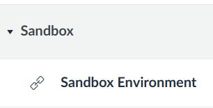<br>

3. Однако в виду ограничений на некоторые функции в данной среде для выполнения некоторых пунктов **задания 1** использовался аккаунт из `module 4` **Lab-1**<br>
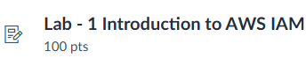

## Задание 1. Создание IAM группы и пользователя
1. Открываю в консоле сервис IAM <br>
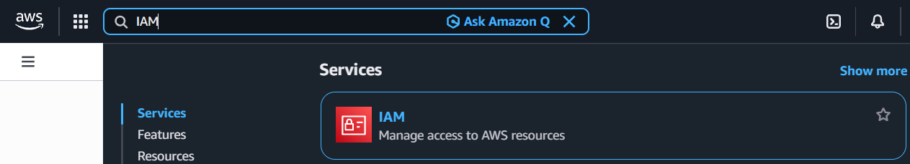<br>

2. В панеле слева нажимаю на `Groups` => `Create New Group` и ввожу имя группы `Admins`<br>
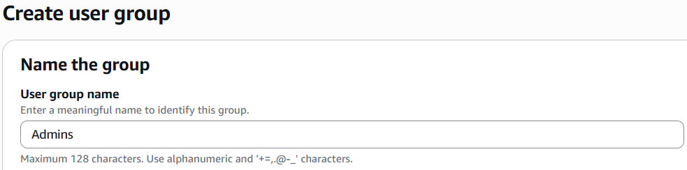<br>

3. На шаге `Attach Policy` выбираю политику `AdministratorAccess`.<br>
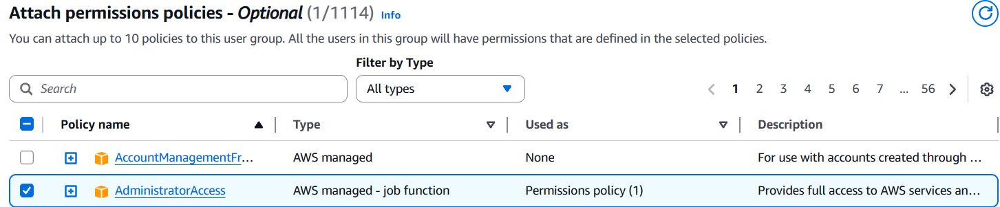<br>

**Контрольный вопрос:**  
Что делает политика `AdministratorAccess`? <br>
Политика `AdministratorAccess` в `AWS` даёт пользователю `полный` доступ ко всем ресурсам и сервисам `AWS`. <br>

4. Для создания пользователя нужно перейти в раздел `Users` => `Add user`.<br>
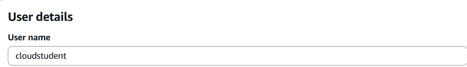 <br>

5. Однако в `sandbox enviroment` запрет на создание новых `пользователей`.<br>
Поэтому для примера воспользуюсь `аккаунтом` из `module 4`. <br>

6. В данном аккаунте уже на старте даётся `3 группы` и `3 пользователя`. <br>
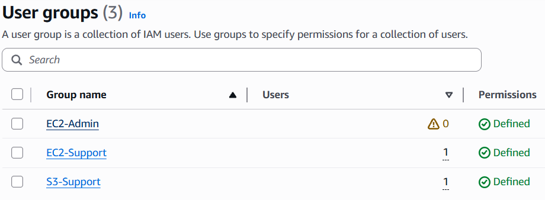<br>
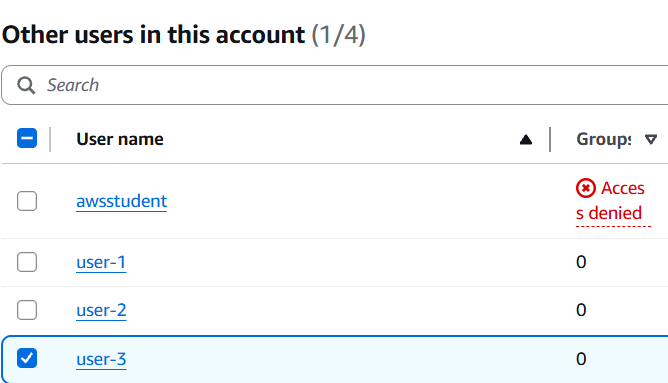<br>

7. И уже здесь чтобы добавить пользователя в группу необходимо:<br>
`IAM` => `USER groups` => выбор группы например `EC2-Admin` => `add users` и в меню ставим галочку напротив `юзера` которого хотим добавить в `группу` и нижимаем кнопку => `Add users`. <br>
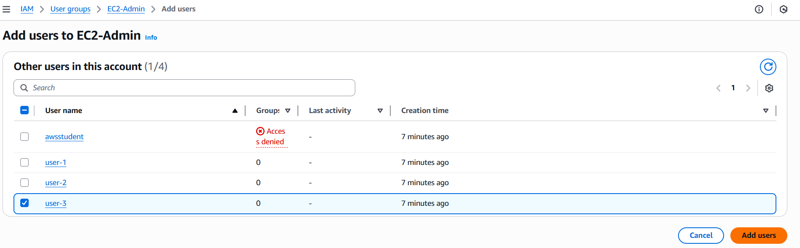 <br>
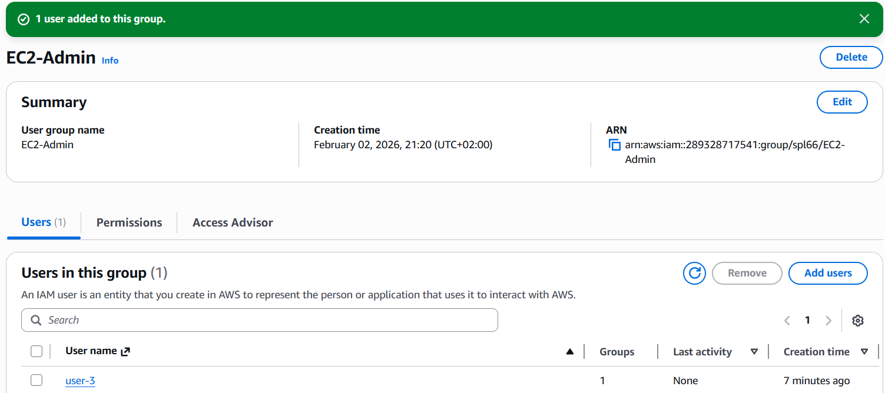 <br>

8. После этого в `dashboard` скопировав `Sign-in URL for IAM users in this account` и вставив в новую вкладку в `браузере` откроится меню для авторизации юзера и введя `IAM user name` и `password` мы войдём в `aws` аккаунт под созданым `юзером` и если у нас например нету прав создания `EC2` мы получим об этом `ошибку`. <br> 

## Задание 2. Настройка Zero-Spend Budget
1. Для создания `Zero-Spend Budget` перехожу в `Billing and Cost Management` => `Budgets` => `Create budget`. <br>
2. Ввожу данные: <br>
- Шаблон `Zero spend budget`
- Budget name: `My Zero-Spend Budget`
- Email recipients: `gulica.roman@usm.md`
- Нажимаю на кнопку `Create budget` внизу страницы.<br>
3. Теперь после создания данного `бюджета` я буду получать уведомления, если мои расходы превысят `$0`.<br>
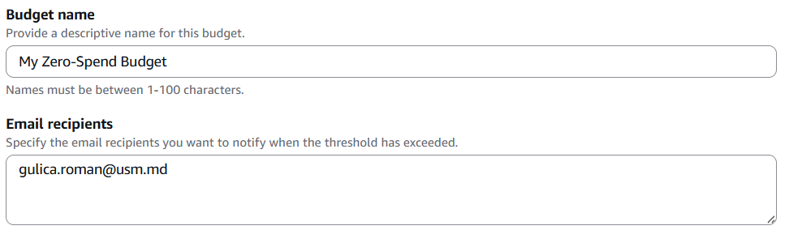<br>
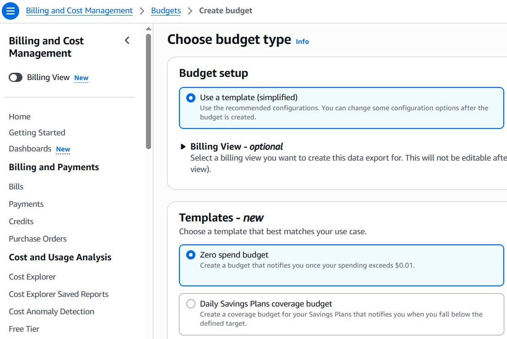<br>

## Задание 3. Создание и запуск EC2 экземпляра (виртуальной машины)<br>
1. Открываю `EC2` => `Instances` => `Launch instances`<br>
2. Ввожу сдедующие данные:<br>
- Name: `webserver`.
- AMI: `Amazon Linux 2023 kernel-6.1 AMI`.
- Instance type: `t3.micro`.
- Key pair. `GulicaRoman-keypair.pem`.
 - 1) Создаю новый ключ и сохраняю в свою папку на локальном компьютере
- New security groups: `webserver-sg`.
- Inbound rules.
 - 1) Type: `SSH`; Source type `My IP`
 - 2) Type: `HTTP`; `0.0.0.0/0`
- Network settings: `По умолчанию`.
- Configure Storage. `По умолчанию`.
- `Advanced details` => `User Data` вставляю скрипт => <br>
```
#!/bin/bash
dnf -y update
dnf -y install htop
dnf -y install nginx
systemctl enable nginx
systemctl start nginx
```
<br>

3. Скриншоты создания EC2 <br>
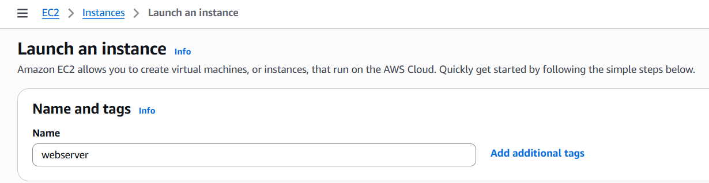<br>
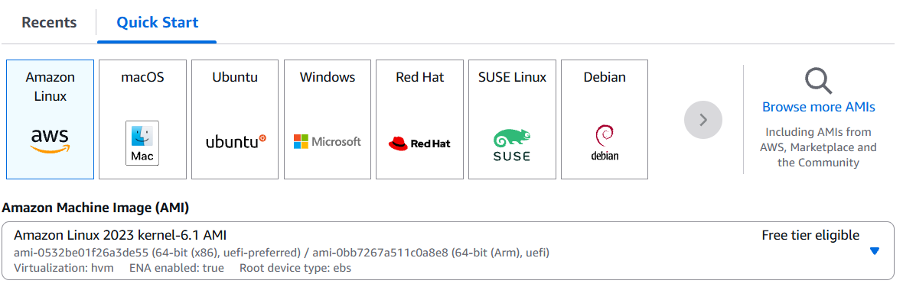<br>
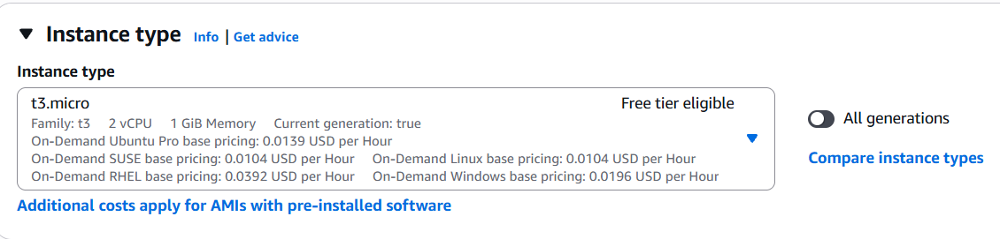<br>
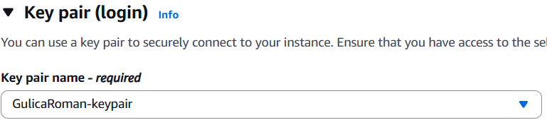<br>
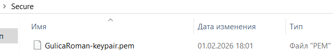<br>
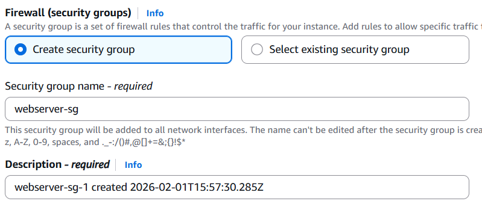<br>
<br>
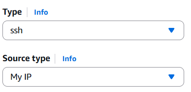<br>
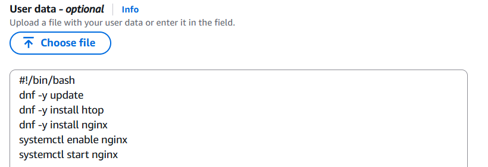<br>

4. В EC2 => Instances видно созданный `EC2` `webserver`<br>
`Bastion-Host` это сервер который автоматически создался при генерации аккаунта<br>
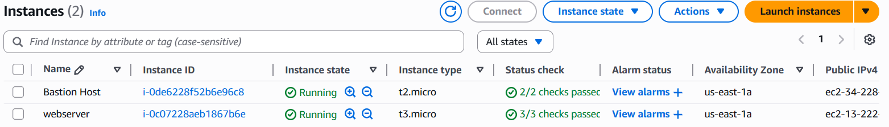<br>

5. Копирую IPv4 Public IP и проверяю в браузере работает ли сервер<br>
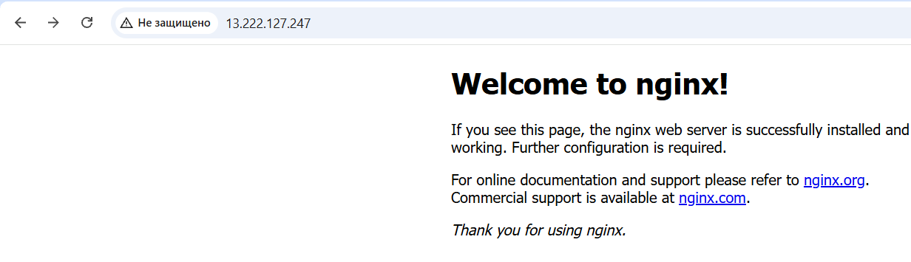<br>
Всё ок! Сервер работает.<br>

## Задание 4. Логирование и мониторинг<br>
1. Нажимаю на инстанс webserver и открываю вкладку Status checks.
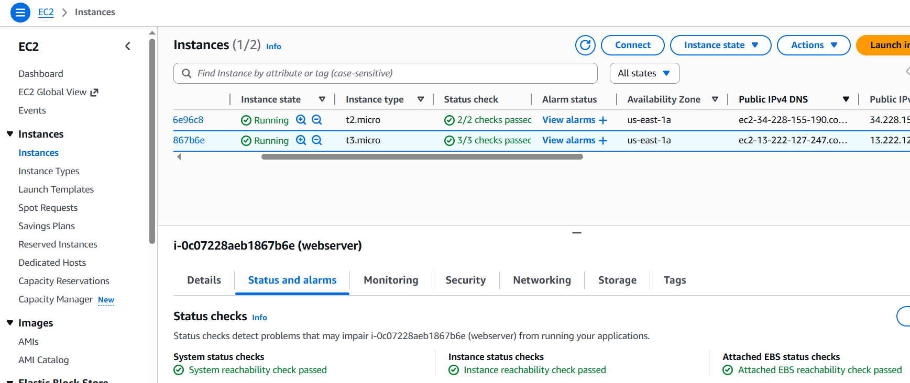 <br>

2. Все проверки прошли успешно (3/3 checks passed).<br>

**Контрольный вопрос:**<br>
Monitoring. <br>
В каких случаях важно включать детализированный мониторинг? <br>
Детализированный мониторинг включают, когда необходимо быстро видеть изменения в работе сервиса. <br>
Он важен:<br>
- при резких скачках нагрузки
- для продакшн систем
- когда нужны быстрые оповещения об ошибках
- при автоматическом масштабировании

3. Просмотр системного лога (System Log)<br>
4. Перехожу в `Actions` => `Monitor and troubleshoot` => `Get system log`.<br>
5. Листаю вниз чтобы просмотреть строки, показывающие установку пакетов `nginx`.<br>
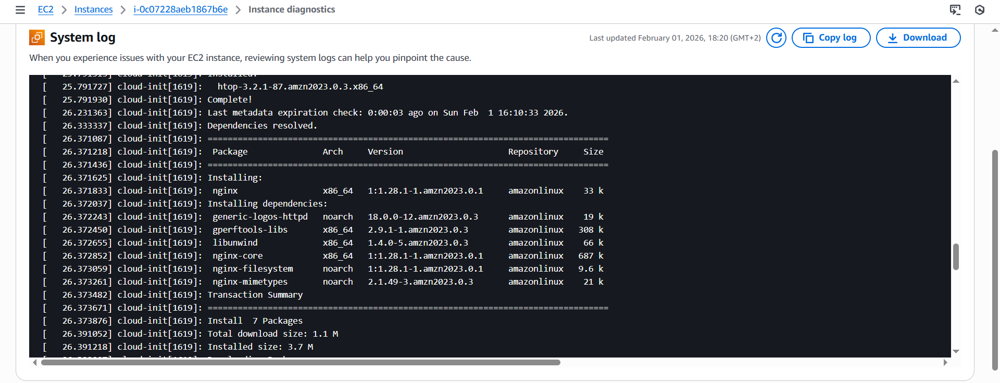 <br>

6. Просмотр снимка экрана инстанса (Instance Screenshot) <br>
7. Для этого перехожу в `Actions` => `Monitor and troubleshoot` => `Get instance screenshot`. <br>
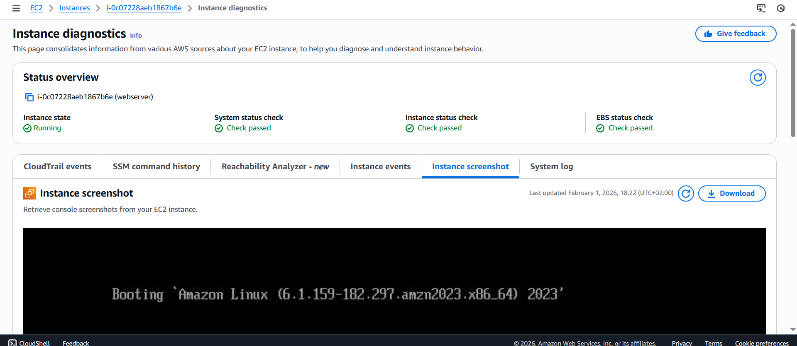 <br>

## Задание 5. Подключение к EC2 инстансу по SSH <br>
1. Перехожу в директорию, где сохранён файл приватного ключа .pem.<br>
2. Устанавливаю права на ключ <br>
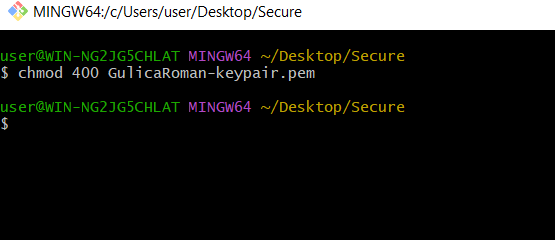 <br>

3. Подключитесь к инстансу по SSH: <br>
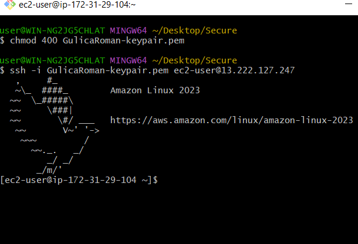 <br>

4. Выполняю команду для проверки статуса веб-сервера Nginx: <br>
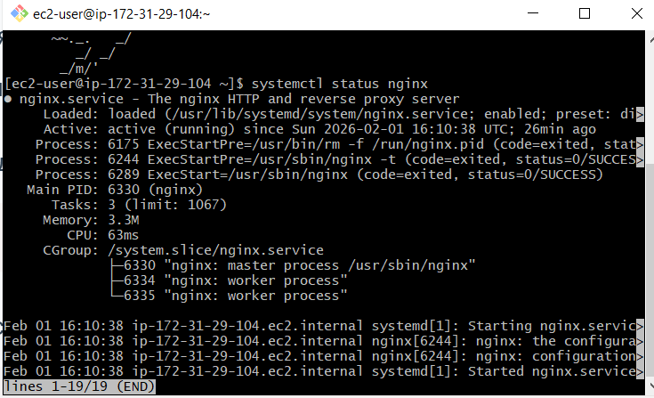 <br>
Все ок! <br>

**Контрольный вопрос:**<br>
Почему в AWS нельзя использовать пароль для входа по SSH? <br>
Потому что парольный вход по SSH небезопасен.<br>
В AWS используют SSH key pair,так как:
- это соответствует требованиям безопасности AWS
- AWS отключает вход по паролю и разрешает вход только по SSH-ключу.
- пароль можно легко подобрать например через (brute-force)
- ключи намного сложнее взломать
- ключ можно хранить только у владельца (приватный ключ) <br>

## Задание 6a. Развёртывание статического веб-сайта (Для специализаций Frontend & Backend & Security)
1. Создаю на локальном компьютере 3 HTML-файла:<br>
- index.html - главная страница сайта.
- about.html - страница "О нас".
- contact.html - страница "Контакты".<br>

2. Копирую файлы на сервер через `scp` <br>
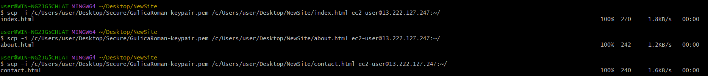 <br>
Файлы успешно скопировались в домашнюю директорию сервера.<br>

**Контрольный вопрос:**<br>
Что делает команда scp? <br>
Команда scp копирует файлы между компьютерами по SSH.<br>
scp позволяет безопасно передать файлы с одного компьютера на другой через интернет с использованием SSH-ключа и шифрования<br>

3. Подключение к EC2 по SSH<br>
4. Проверка файлов в домашней папке<br>
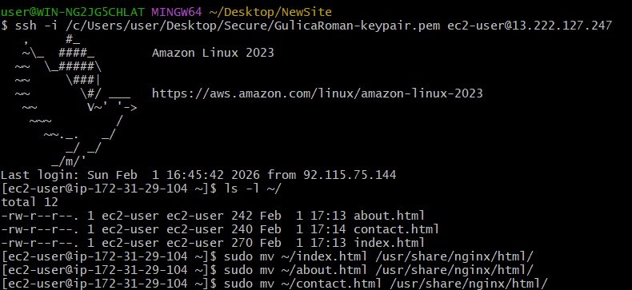 <br>

5. файлы находятся на сервере<br>
6. Перемещение файлов в папку Nginx `sudo`<br>
7. Проверка файлов в папке Nginx <br>
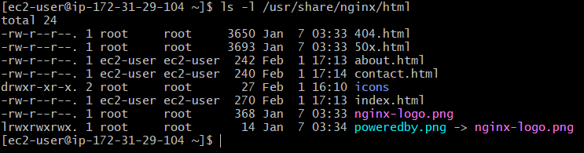 <br>

8. Проверка сайта <br>
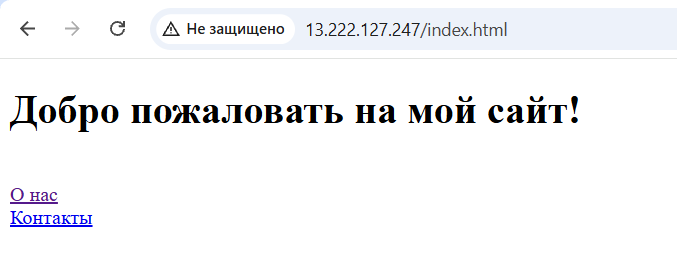<br>
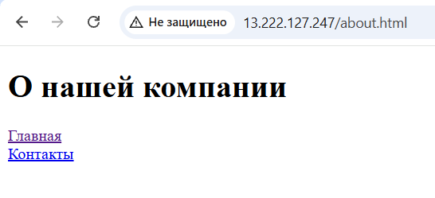<br>
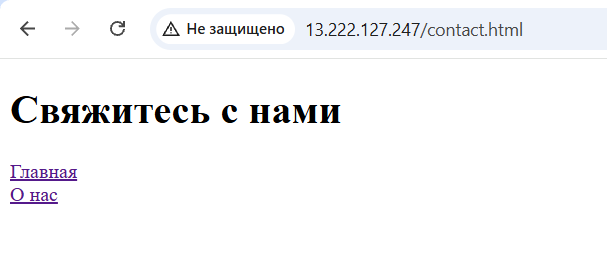<br>

## Задание 7. Завершение работы и удаление ресурсов<br>
1. Останавливаю запущенную виртуальную машину (инстанс EC2) используя AWS CLI.<br>
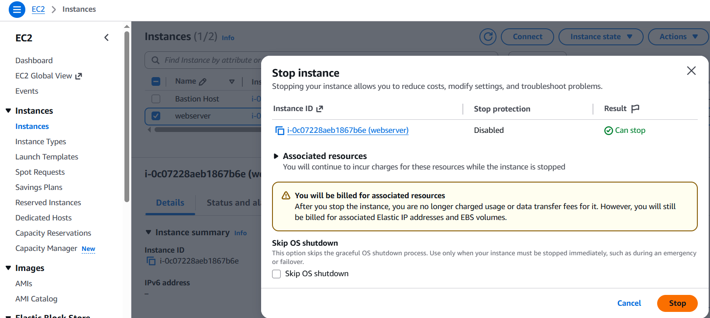<br>
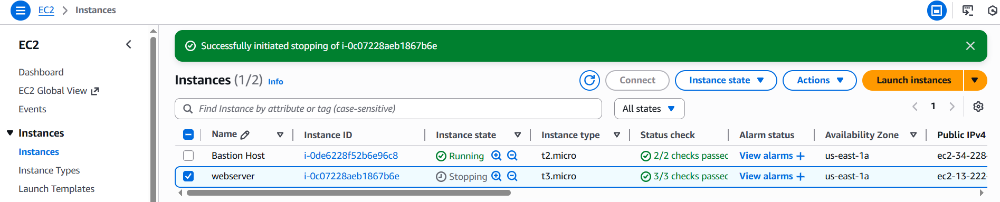<br>

**Контрольный вопрос:**<br>
Чем «Stop» отличается от `Terminate`<br>
`Stop` - остановить инстанс<br>
- данные на диске (EBS) сохраняются
- за сам инстанс не платишь (платишь только за диск)<br>
- инстанс можно потом снова запустить
- виртуальная машина выключается

`Terminate` - удалить инстанс<br>
- виртуальная машина удаляется навсегда
- запустить обратно нельзя
- данные теряются (если диск удаляется)

## Источники
https://elearning.usm.md/<br>
https://docs.aws.amazon.com/<br>
Презентация. Введение в облачные вычисления<br>
Презентация. Архитектура облачных систем и основы виртуализации<br>
Презентация. Введение в Amazon Web Services (AWS). Глобальная архитектура AWS<br>
Презентация. Введение в вычислительные сервисы. Amazon AWS Elastic Compute Cloud<br>

## Вывод
Научился:<br>
- Cоздавать и входить в aws аккаунт<br>
- Создавать IAM пользователей и группы<br>
- Настраивать бюджет Zero-Spend<br>
- Создавать и запускать EC2 инстансы<br>
- Произоводить логирование и мониторинг<br>
- Подключаться по SSH<br>
- Развёртывать статический веб-сайт<br>
- Завершать работу и удалять ресурсы<br>