# Лабораторная работа 3
## IAFR2302 Gulica Roman  
**Тема:** Облачные сети

## Цель работы
Научиться вручную создавать виртуальную сеть (VPC) в AWS, добавлять в неё подсети, таблицы маршрутов, интернет-шлюз (IGW) и NAT Gateway, а также настраивать взаимодействие между веб-сервером в публичной подсети и сервером базы данных в приватной.

## Этапы работы
1. Подготовка среды  
1. Создание VPC
2. Создание Internet Gateway (IGW)
3. Создание подсетей
4. Логирование и мониторинг
- 4.1 Создание публичной подсети
- 4.2 Создание приватной подсети
5. Создание таблиц маршрутов (Route Tables)
- 5.1. Создание публичной таблицы маршрутов
- 5.1. Создание приватной таблицы маршрутов
6. Создание NAT Gateway
- 6.1. Создание Elastic IP
- 6.2. Создание NAT Gateway
- 6.3. Изменение приватной таблицы маршрутов
7. Создание Security Groups
8. Создание EC2-инстансов
9. Проверка работы<br>


## Шаг 1. Подготовка среды
1. Для выполнения лабораторных работ использовался **аккаунт** из **aws academy**.<br>
2. Как основная среда использовался аккаунт из **Sandbox Environment**<br>
<br>

## Шаг 2. Создание VPC
1. Перехожу в `Your VPCs` => `Create VPC`.<br>
2. Указываю данные:<br>
- Name tag: `student-vpc-k14`
- IPv4 CIDR block: `10.14.0.0/16`
- Tenancy: `Default`<br>
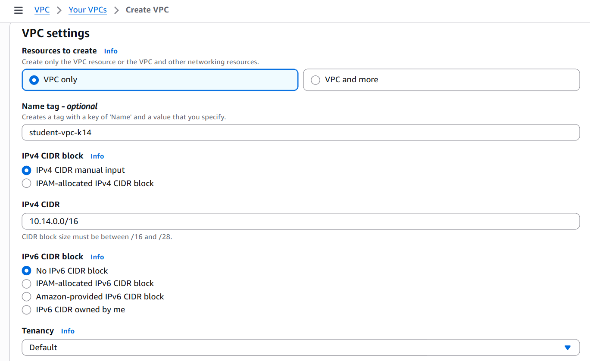<br>

**Контрольный вопрос**<br>
Что обозначает маска /16? И почему нельзя использовать, например, /8?<br>
Маска /16 означает, что первые 16 бит IP-адреса это сеть, а остальное адреса устройств.<br>
/16 => сеть вида 10.0.0.0 - 10.0.255.255 это около 65 536 IP-адресов <br>
/8 => это огромная сеть: например 10.0.0.0/8 это 16+ миллионов IP-адресов<br>
Проблемы с /8:<br>
- возможные конфликты при VPN / VPC Peering
- AWS не рекомендует такие большие диапазоны
- слишком большая сеть для одной VPC
- сложнее управлять и разделять подсети <br>
Использовать /8 не рекомендуется, так как слишком большой диапазон и сложный в управлении а также может вызывать конфликты в AWS-сетях.<br>

3. Нажимаю на `Create VPC`.<br>
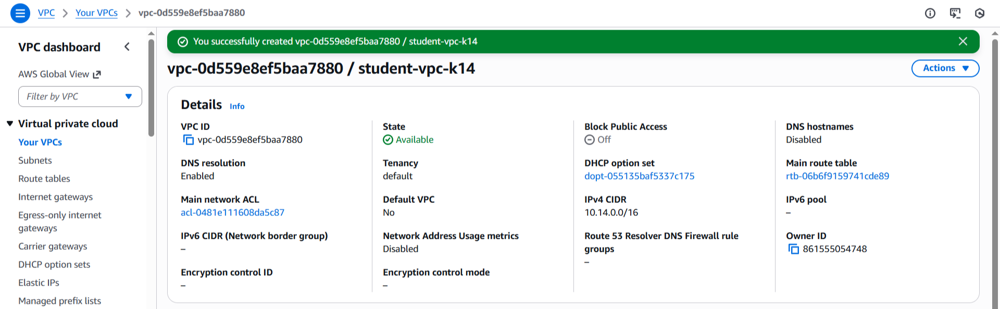<br>

## Шаг 3. Создание Internet Gateway (IGW)

1. Выбераю `Internet Gateways` => `Create internet gateway`.
2. Указываю данные:<br>
- имя: `student-igw-k14`<br>
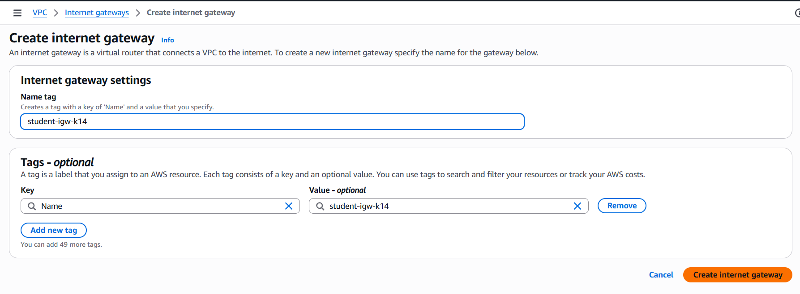<br>
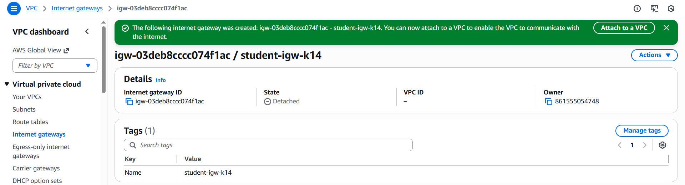<br>

3. Выбераю созданный IGW.<br>
4. В списке выбераю `student-vpc-k14`.<br>
5. `Actions` => `Attach to VPC`.<br>
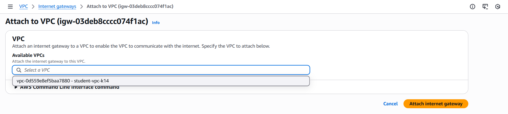<br>
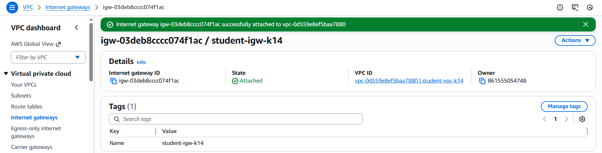<br>

## Шаг 4. Создание подсетей
### Шаг 4.1. Создание публичной подсети
1. Выбераю `Subnets` => `Create subnet`.<br>
2. Указываю:<br>
- VPC ID: `student-vpc-k14`
- Subnet name: `public-subnet-k14`
- Availability Zone: `us-east-1a`
- IPv4 CIDR block: `10.14.1.0/24`<br>
3. Нажимаю Create subnet.<br>
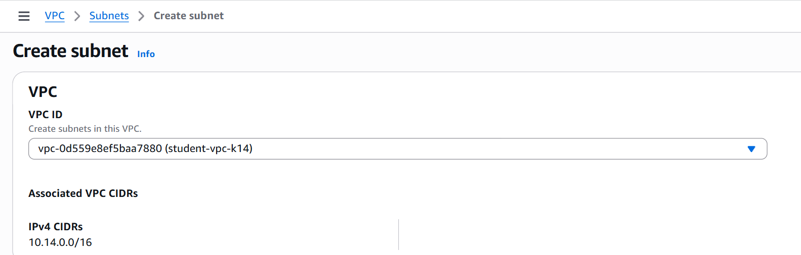<br>
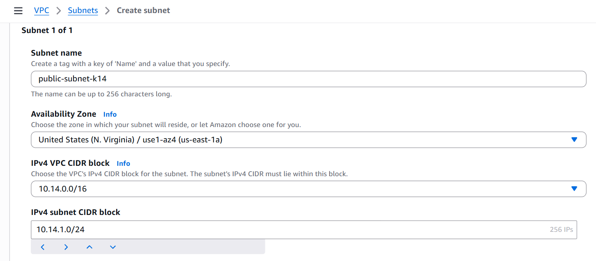<br>
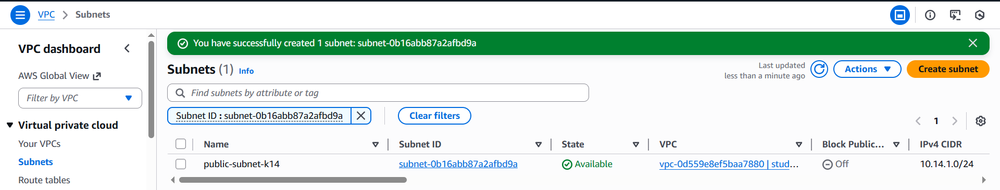<br>

**Контрольныё вопрос**<br>
Является ли подсеть `публичной` на данный момент? Почему? <br>
Подсеть `public-subnet-k14` не является публичной.<br>
Потому что при создании подсети она ещё не связана с `Internet Gateway` через таблицу маршрутизации.<br>
Без маршрута `0.0.0.0/0` `Internet Gateway` подсеть не имеет выхода в интернет.<br>

### Шаг 4.2. Создание приватной подсети
1. Нажимаю `Create subnet` ещё раз.<br>
2. Указываю:<br>
- VPC ID: `student-vpc-k14`
- Subnet name: `private-subnet-k14`
- Availability Zone: `us-east-1b`
- IPv4 CIDR block: `10.14.2.0/24`<br>
3. Нажимаю `Create subnet`.<br>
<br>
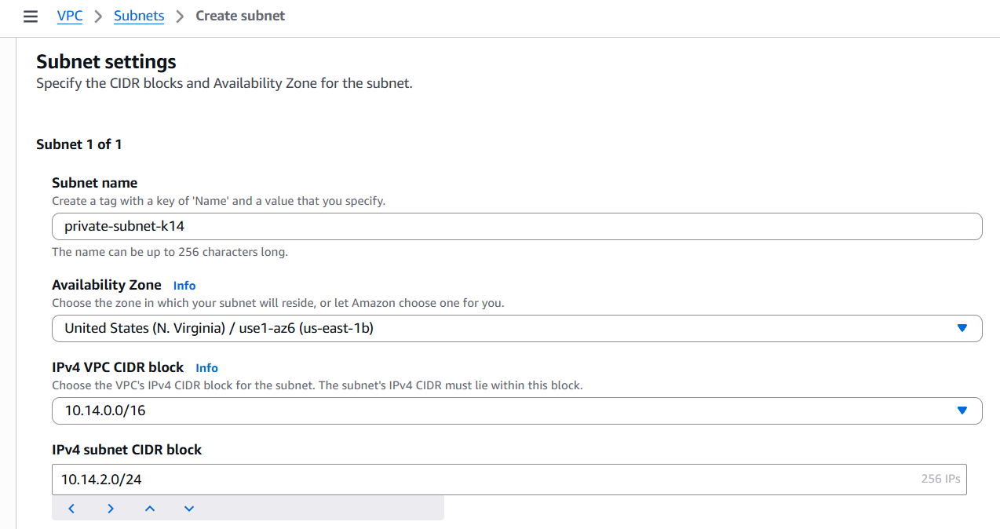<br>
<br>

**Контрольныё вопрос**<br>
Является ли подсеть "приватной" на данный момент? Почему?<br>
Подсеть `public-subnet-k14` не является приватной.<br>
Потому что при создании подсети она ещё не связана с `Internet Gateway` через таблицу маршрутизации.<br>
Пока не будет настроена таблица маршрутизации, подсеть не будет публичной.<br>

## Шаг 5. Создание таблиц маршрутов (Route Tables)
### Шаг 5.1. Создание публичной таблицы маршрутов
1. Выбераю `Route Tables` => `Create route table`.<br>

2. Указываю:<br>
- Name tag: `public-rt-k14`
- VPC: `student-vpc-k14`<br>

3. Нажимаю `Create route table`<br>
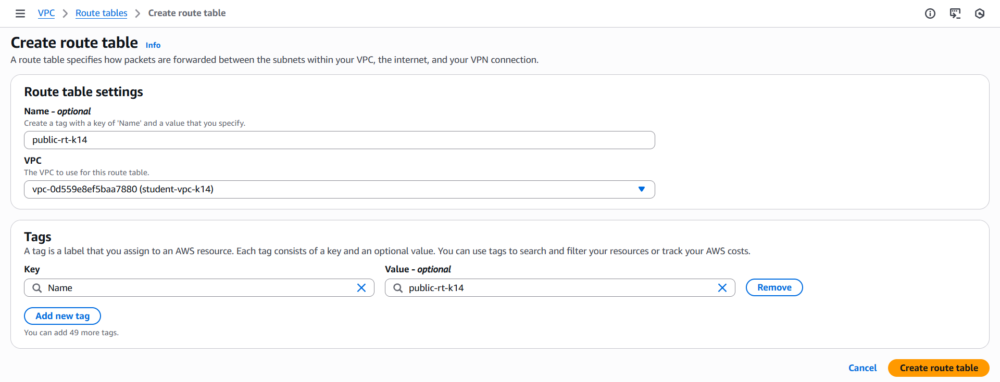<br>
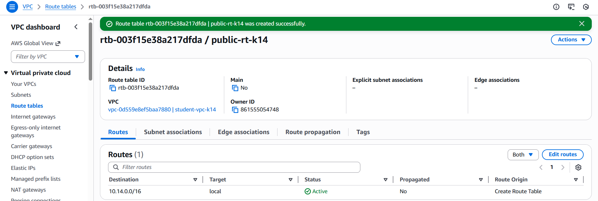<br>

4. Перехожу на `Routes` => `Edit routes` => `Add route`.<br>
5. Заполняю:<br>
- Destination: `0.0.0.0/0`
- Target: `student-igw-k14`.<br>
6. Нажимаю `Save changes`.
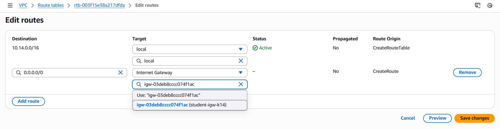<br>

7. Перехожу `Subnet associations` => `Edit subnet associations`.<br>
8. Отмечаю `public-subnet-k14` и нажимаю `Save associations`.<br>
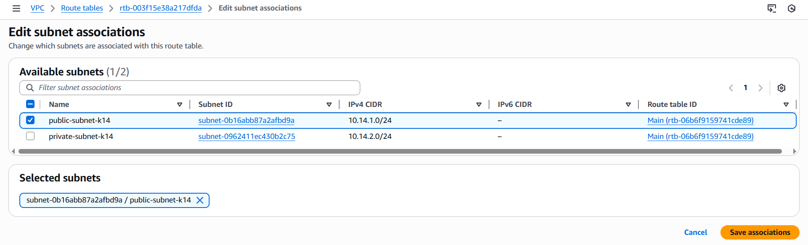<br>
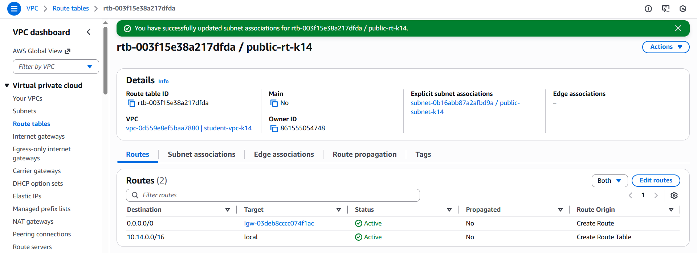<br>
**Контрольный вопрос**
Зачем необходимо привязать таблицу маршрутов к подсети?<br>
Без привязки таблицы маршрутов подсеть не знает, куда отправлять трафик.<br>

### Шаг 5.2. Создание приватной таблицы маршрутов
1. Нажимаю `Create route table` ещё раз.<br>
2. Указываю:<br>
- Name tag: `private-rt-k14`
- VPC: `student-vpc-k14`<br>
3. Нажимаю `Create route table`.<br>
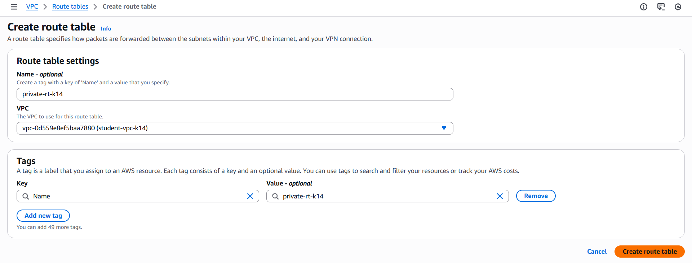<br>

4. Перехожу `Subnet associations` => `Edit subnet associations`.<br>
5. Отмечаю `private-subnet-k14` и нажмите `Save associations`.<br>
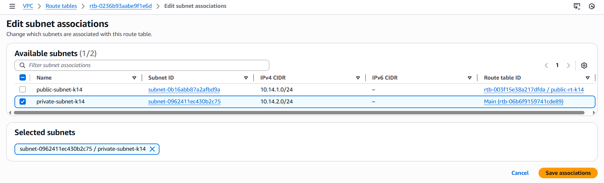<br>
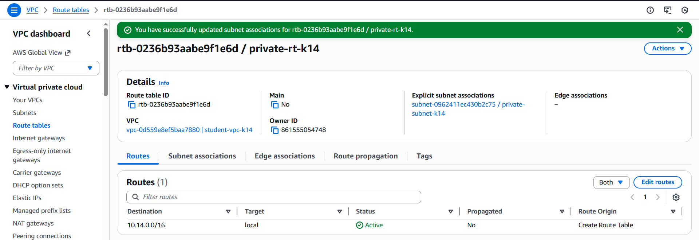<br>

## Шаг 6. Создание NAT Gateway
### Шаг 6.1. Создание Elastic IP

1. Выбераю `Elastic IPs` => `Allocate Elastic IP address`.<br>
2. Нажимаю `Allocate`.<br>
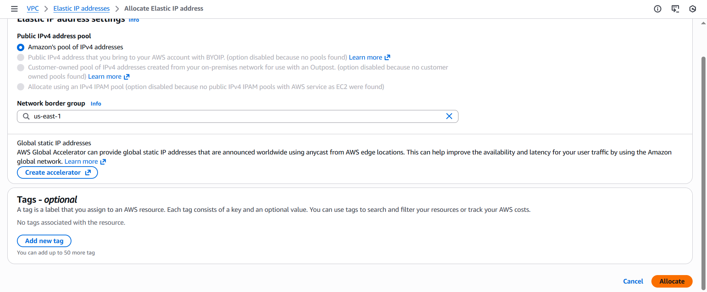<br>
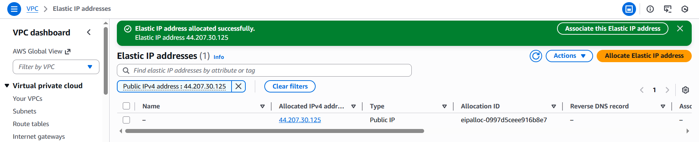<br>

### Шаг 6.2. Создание NAT Gateway
1. Выбераю `NAT Gateways` => `Create NAT gateway`.<br>
2. Указываю:<br>
- Name tag: `nat-gateway-k14`
- Subnet: `public-subnet-k14`
- Connectivity type: `Public`
- Elastic IP allocation ID: `только что созданный`<br>
3. Нажимаю `Create NAT gateway`.<br>
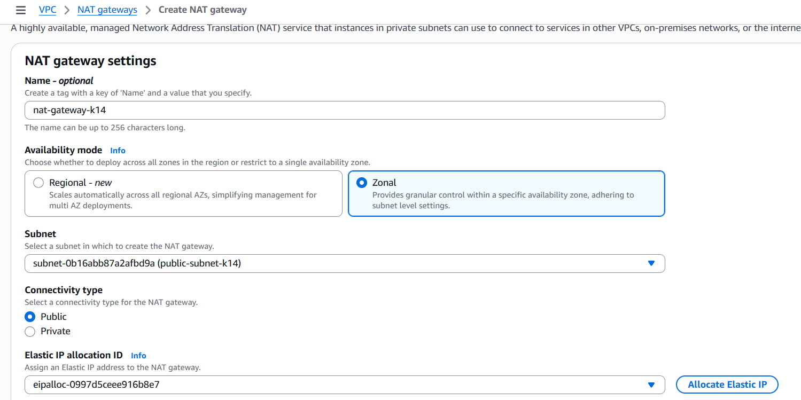<br>
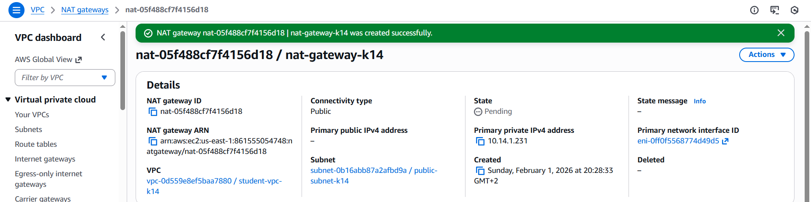<br>
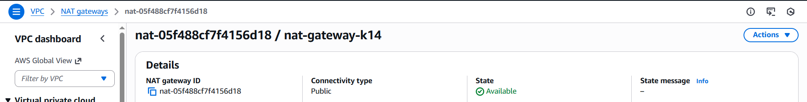<br>

### Шаг 6.3. Изменение приватной таблицы маршрутов
1. Выбераю `Route Tables` => `private-rt-k14`.<br>
2. Перехожу `Routes` => `Edit routes` => `Add route`.<br>
3. Заполняю:<br>
- Destination: `0.0.0.0/0`
- Target: `nat-gateway-k14`.<br>
4. Нажимаю `Save changes`.<br>
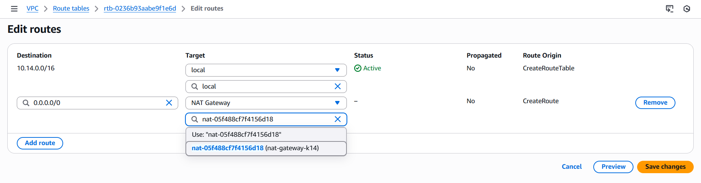<br>

## Шаг 7. Создание Security Groups
1. Выбераю `Security Groups` => `Create security group`.<br>

2. Указываю:<br>
- Security group name: `web-sg-k14`
- Description: `Security group for web server`
- VPC: `student-vpc-k14`<br>
`Inbound rules`<br>
- Тип: HTTP, Протокол: TCP, Порт: 80, Источник: 0.0.0.0/0
- Тип: HTTPS, Протокол: TCP, Порт: 443, Источник: 0.0.0.0/0<br>
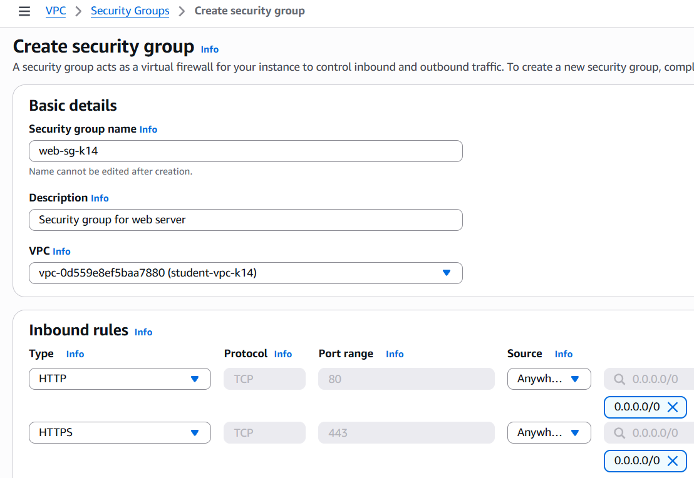<br>

3. Создаю еще две `Security Groups`:<br>
`bastion-sg-k14` для bastion host с разрешением входящего трафика на порт 22 (SSH) только из моего IP-адреса.<br>
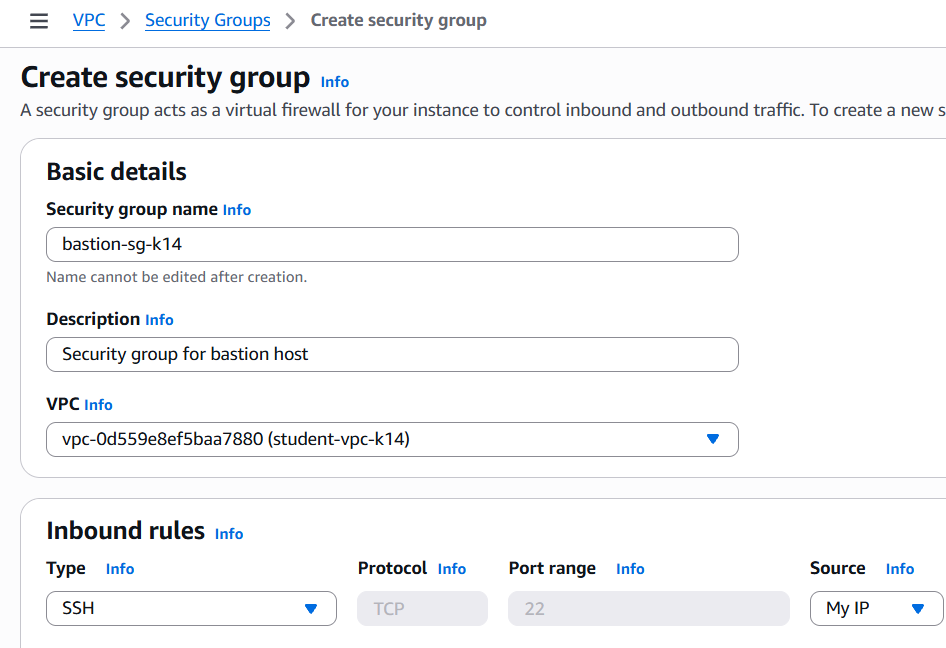<br>

`db-sg-k14` для базы данных с разрешением входящего трафика:<br>
- Тип: MySQL/Aurora, Протокол: TCP, Порт: 3306, Источник: web-sg-k14
- Тип: MySQL/Aurora, Протокол: TCP, Порт: 3306, Источник: bastion-sg-k14
- Тип: SSH, Протокол: TCP, Порт: 22, Источник: bastion-sg-k14<br>
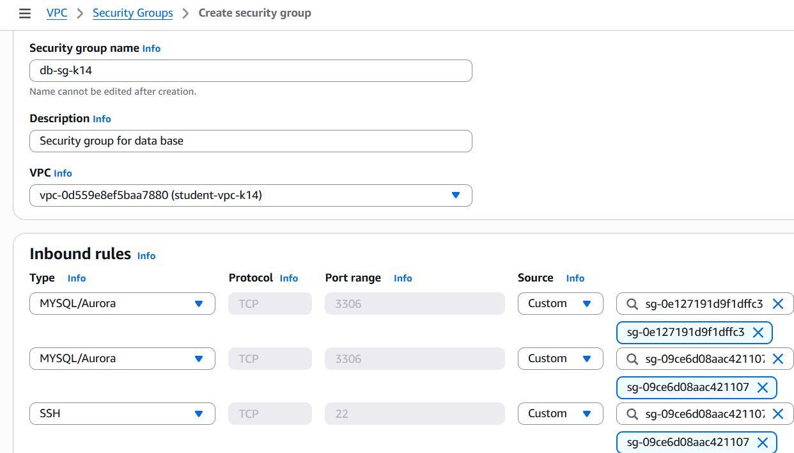<br>

**Контрольный вопрос**
Что такое Bastion Host и зачем он нужен в архитектуре с приватными подсетями?<br>
Bastion Host это специальный сервер для доступа к приватным ресурсам.<br>
Bastion Host это EC2 в публичной подсети, через который по SSH подключаются к серверам в приватных подсетях.<br>


## Шаг 8. Создание EC2-инстансов
1. Создаю три EC2-инстанса<br>
`web-server` - в публичной подсети, доступен из Интернета по HTTP.<br>
`db-server` - в приватной подсети, недоступен напрямую извне.<br>
`bastion-host` - в публичной подсети, для безопасного доступа к приватным ресурсам.<br>

2. Для всех инстансов использую:<br>
- AMI: `Amazon Linux 2023 kernel-6.1 AMI`
- Тип инстанса: `t3.micro`
- Key Pair: `student-key-k14`.
- Хранилище: `по умолчанию 8 ГБ`.<br><br>

3. Для `web-server`:<br>
- VPC: `student-vpc-k14`
- Subnet: `public-subnet-k14`
- Auto-assign Public IP: `Enable`
- Security Group: `web-sg-k14`<br>
`Advanced Details` => `User data`<br>
```
#!/bin/bash
dnf install -y httpd php
echo "<?php phpinfo(); ?>" > /var/www/html/index.php
systemctl enable httpd
systemctl start httpd
```
<br>

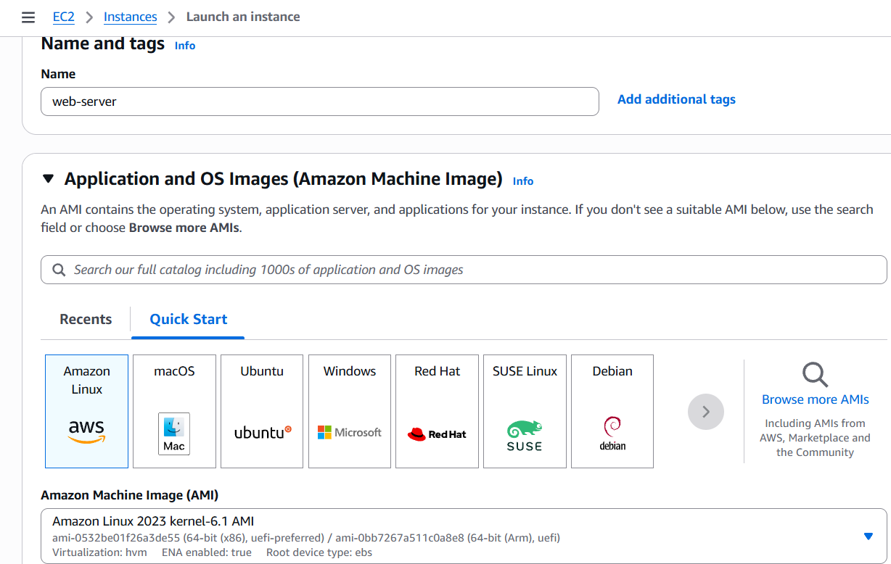<br>
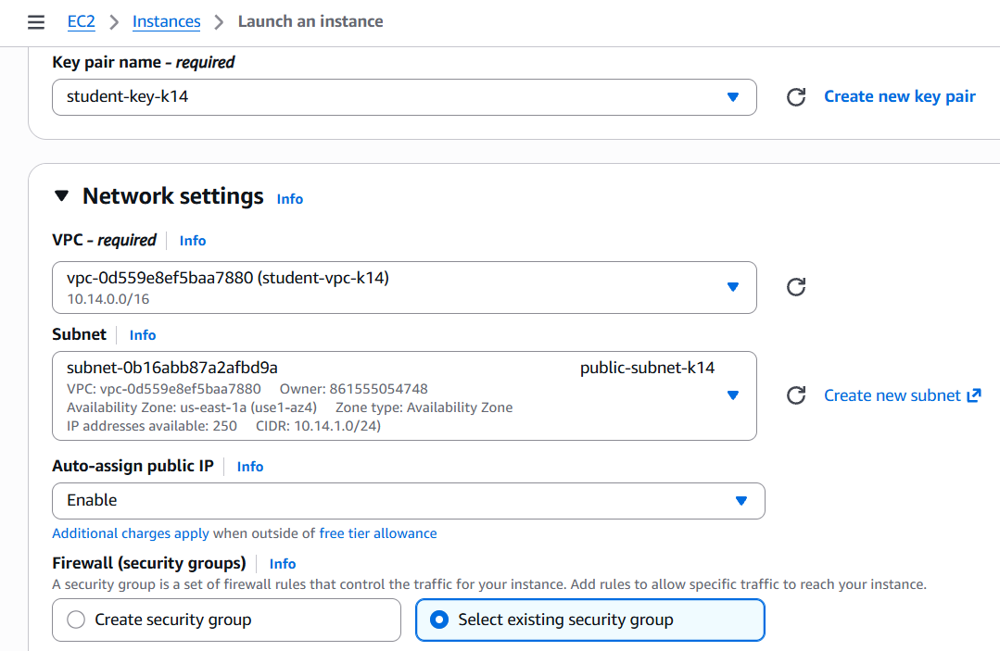<br>
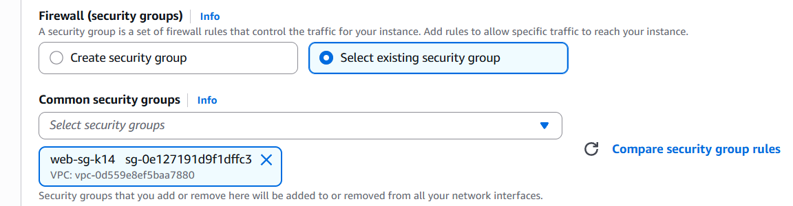<br>
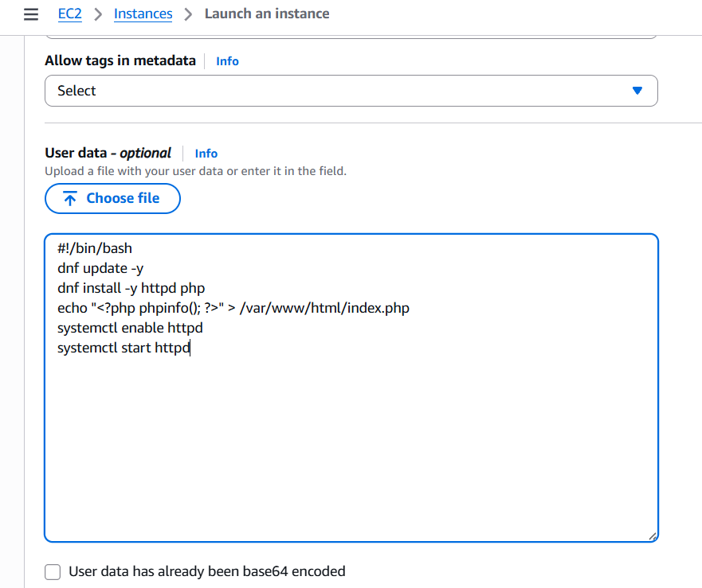<br>
<br>

4. `db-server`:<br>
- VPC: `student-vpc-k14`
- Subnet: `private-subnet-k14`
- Auto-assign Public IP: `Disable`
- Security Group: `db-sg-k14`<br>
`Advanced Details` => `User data`<br>
```
#!/bin/bash
dnf install -y mariadb105-server
systemctl enable mariadb
systemctl start mariadb
mysql -e "ALTER USER 'root'@'localhost' IDENTIFIED BY 'StrongPassword123!'; FLUSH PRIVILEGES;"
```
<br>

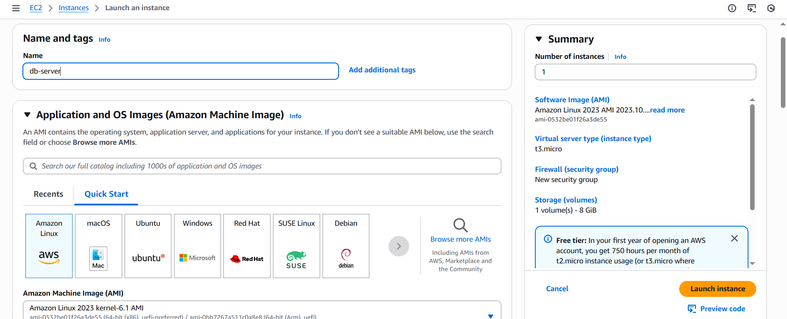<br>
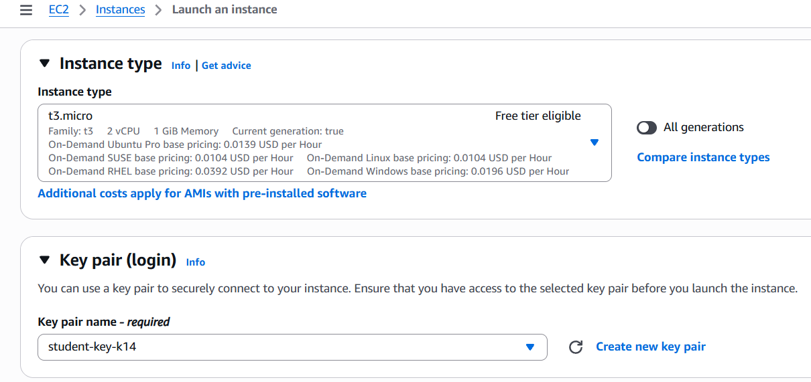<br>
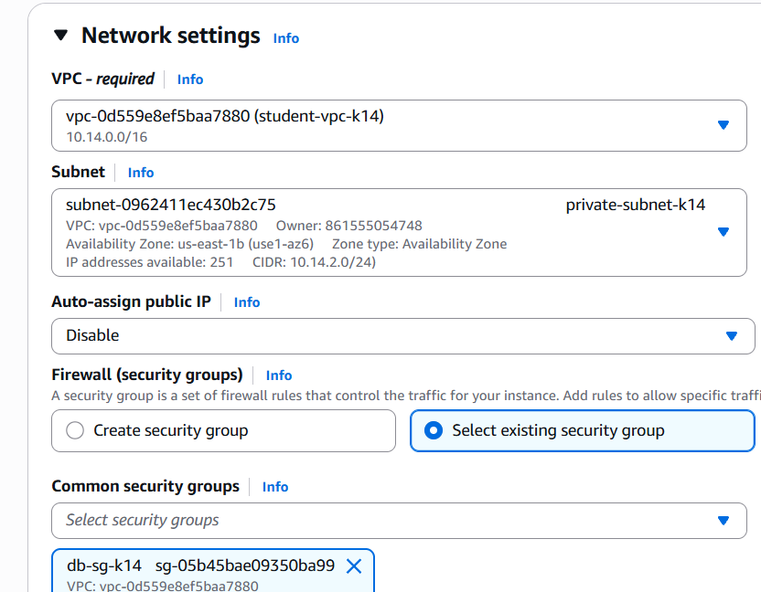<br>
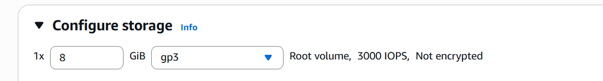<br>
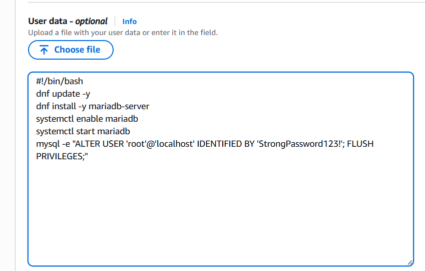<br>
<br>

5. `bastion-host`:<br>
- VPC: `student-vpc-k14`
- Subnet: `public-subnet-k14`
- Auto-assign Public IP: `Enable`
- Security Group: `bastion-sg-k14`<br>
`Advanced Details` => `User data`<br>
```
#!/bin/bash
dnf install -y mariadb105
```
<br>

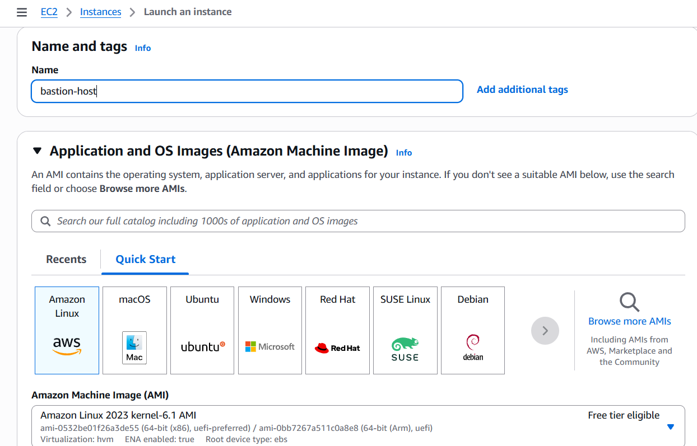<br>
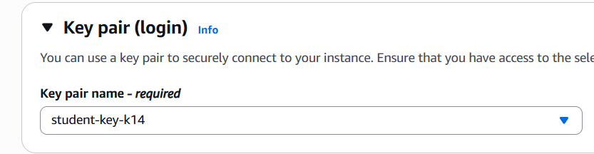<br>
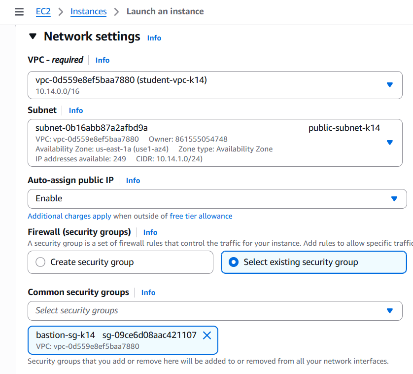<br>
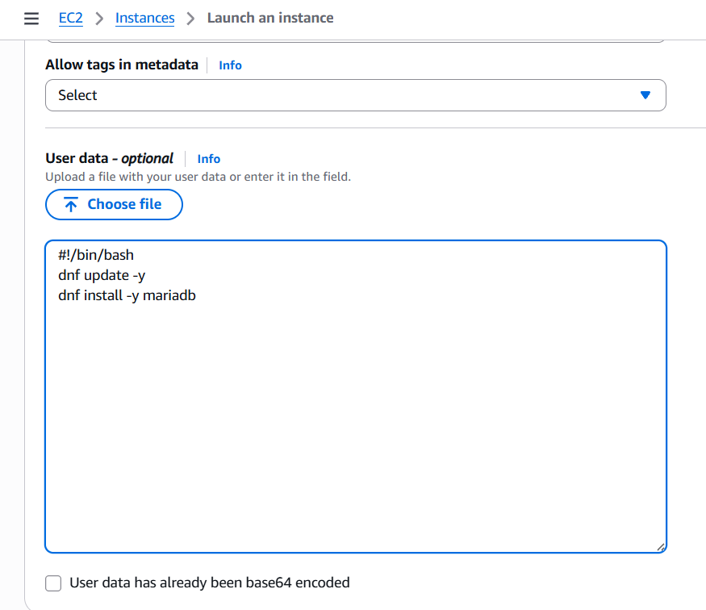<br>

## Шаг 9. Проверка работы
1. Беру IP-адрес web-server и открываю его в браузере.<br>
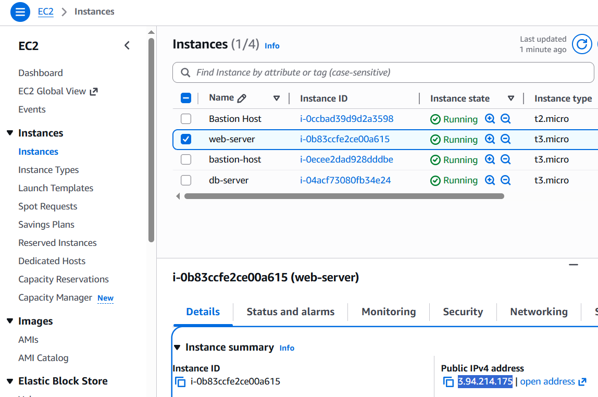<br>
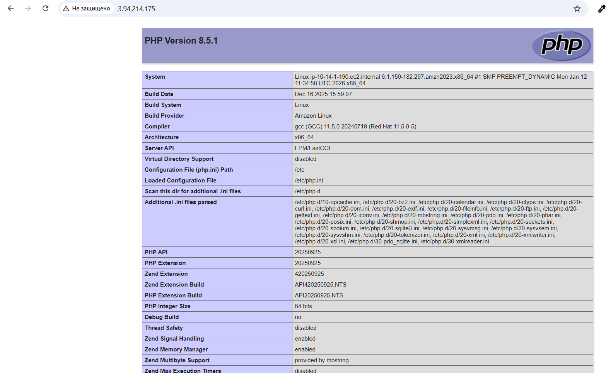<br>

2. Подключаюсь к bastion-host по SSH:<br>
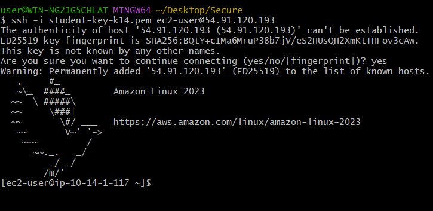<br>
3. Проверяю подключение к интернету с bastion-host выполнив ping:<br>
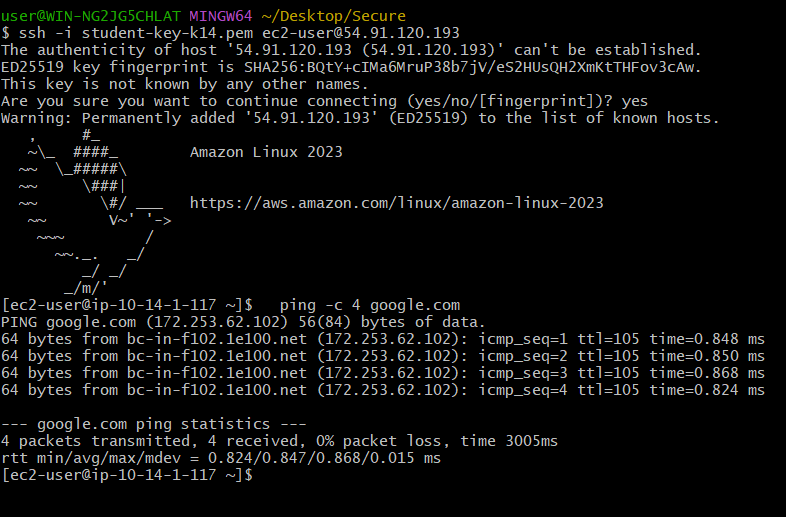<br>

## Завершение работы
Аккаунт имеет 3 часа на использования.<br>
После этого все ресуры как EC2, VPC удаляються автоматически вместе с аккаунтом.<br>

## Источники
https://elearning.usm.md/<br>
https://docs.aws.amazon.com/<br>
Презентация. Введение в облачные вычисления<br>
Презентация. Архитектура облачных систем и основы виртуализации<br>
Презентация. Введение в Amazon Web Services (AWS). Глобальная архитектура AWS<br>
Презентация. Введение в вычислительные сервисы. Amazon AWS Elastic Compute Cloud<br>
Презентация. Виртуальные сети в облаке. Amazon VPC Fișier<br>

## Вывод
Научился создавать:<br>
- VPC<br>
- Internet Gateway (IGW)<br>
- публичную подсеть<br>
- приватную подсеть<br>
- публичную таблицу маршрутов<br>
- приватную таблицу маршрутов<br>
- Elastic IP<br>
- NAT Gateway<br>
- Security Groups<br>
Изменять приватную таблицу маршрутов<br>