# Лабораторная работа 4
## IAFR2302 Gulica Roman  
**Тема:** Облачное хранилище данных. Amazon S3

## Цель работы
Познакомиться с сервисом Amazon S3 (Simple Storage Service) и отработать основные операции:
- создание публичного и приватного бакетов;
- загрузку и организацию объектов;
- работу с S3 через AWS CLI (копирование, перемещение, синхронизация);
- настройку версионирования и шифрования;
- использование S3 Static Website Hosting;
- применение Lifecycle-правил для архивирования старых данных.

## Этапы работы
1. Подготовка
2. Создание бакетов
3. Загрузка объектов через AWS Management Console
4. Загрузка объектов через AWS CLI
5. Проверка доступа к объектам
6. Версионирование объектов
7. Создание Lifecycle-правил для приватного бакета
8. Создание статического веб-сайта на базе S3

## Шаг 1. Подготовка среды
1. Для выполнения лабораторных работ использовался **аккаунт** из **aws academy**. 
2. Как основная среда использовался аккаунт из **Sandbox Environment** 
 

3. Формат имён бакетов: 
- Публичный: `cc-lab4-pub-k14`
- Приватный: `cc-lab4-priv-k14` 
4. Локально структура каталогов и файлов: 
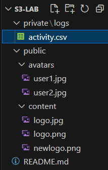 

## Шаг 2. Создание бакетов
**Контрольный вопрос**
1. Чем отличаются два способа управления доступом к бакетам в S3? 

`ACL` - это старый и простой способ: 
- Права задаются прямо у бакета и файлов 
- Можно легко открыть доступ "всем" 
- Часто приводит к ошибкам и небезопасен 

`Object Ownership Enforced` - это новый и безопасный способ: 
- ACL отключены 
- Все файлы принадлежат владельцу  
- Доступ настраивается через политики (IAM, bucket policy) 

2. Первый способ с использованием `ACL`. 
Публичный бакет: 
- Имя: `cc-lab4-pub-k14`
- Region: `eu-east-1`
- Object `Ownership: ACLs enabled`
- Block all public access: `снять галочку`
- `Подтверждаю предупреждение` 

3. Нажимаю `Create bucket` 
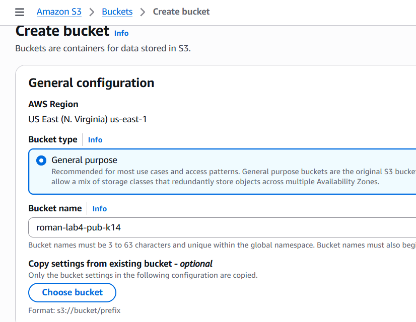 
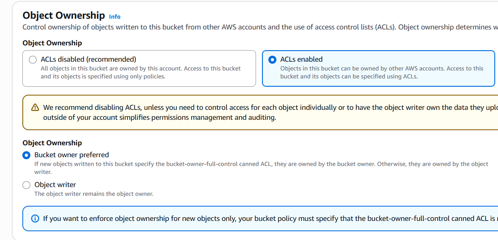 
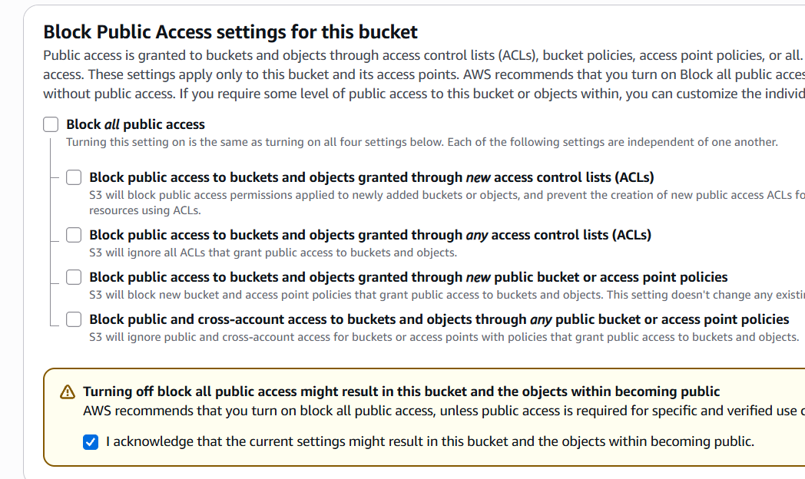 

**Контрольный вопрос**
Что означает опция `Block all public access` и зачем нужна данная настройка? 
`Block all public access` это настройка `S3`, которая полностью запрещает публичный доступ к бакету и его объектам. 

Что она делает: 
- Блокирует публичные ACL 
- Блокирует политики бакета с доступом для Everyone 
- Даже если случайно открыть доступ - он не сработает 

Зачем нужна: 
- Чтобы файлы не стали публичными по ошибке 
- Защищает данные от утечек 

4. Аналогично создаю приватный бакет с именем `cc-lab4-priv-k14`, но оставляю все настройки по умолчанию `Block all public access` - включен. 
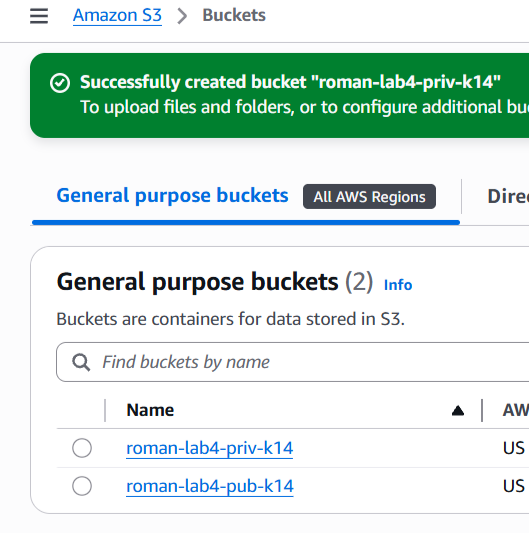 

## Шаг 3. Загрузка объектов через AWS Management Console
1. Перехожу бакет `cc-lab4-pub-k14`.
2. Перехожу в директорию `avatars/` и нажимаю `Upload`.
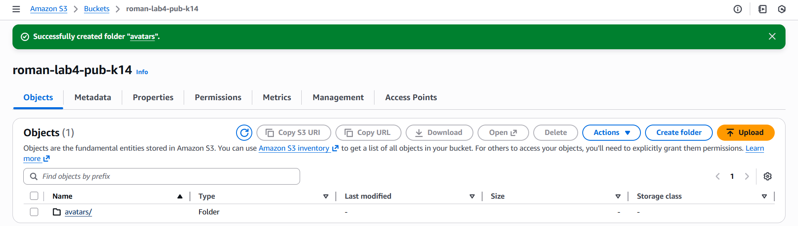 

3. Загружаю файл `user1.jpg` из локальной папки `s3-lab/public/avatars/`.
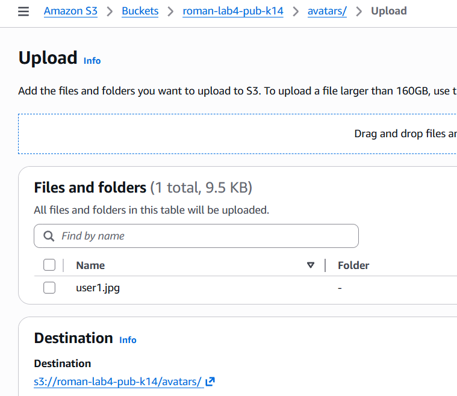 

4. В пункте `Permissions` выбераю `Grant public-read access`.
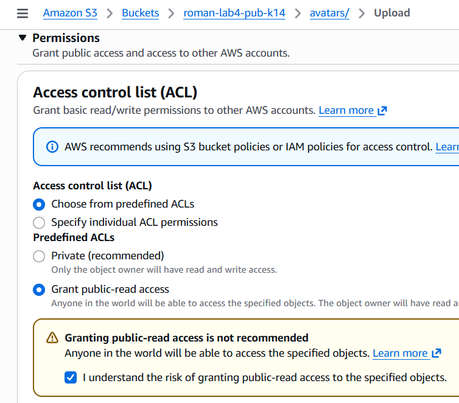 

5. Завершаю загрузку нажав `Upload`.
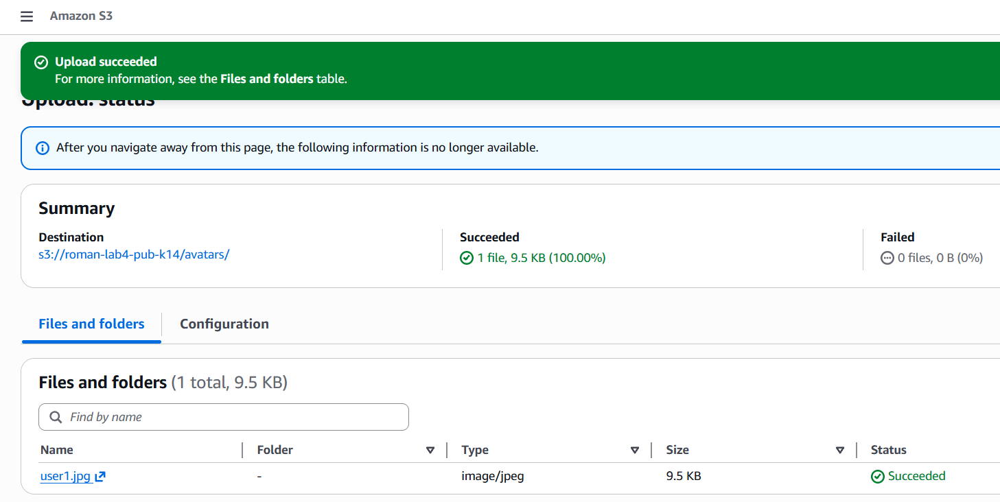 

**Контрольный вопрос**
Чем отличается ключ `object key` от имени файла? 
Имя файла это то, как файл называется у меня на компьютере 
например: `photo.jpg` 

`Object key` это полный путь к объекту в `S3`, включая `папки` 
например: `images/2024/photo.jpg` 

## Шаг 4. Загрузка объектов через AWS CLI
Так как в аккаунте от `aws academy` нельзя использовать `AWS CLI` для следующих операций будет использоваться встроенная консоль в аккаунте aws `CloudShell`. 

1. Загружаю файл `user2.jpg` в публичный бакет: 
2. Загружаю файл `logo.png` в публичный бакет, в директорию `content/`, также сделав его публичным. 
3. Загружаю файл `activity.csv` в приватный бакет, не делая его публичным. 
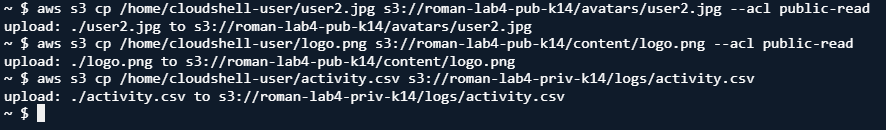 

**Контрольный вопрос**
В чём разница между командами `aws s3 cp`, `mv` и `sync` и для чего используется параметр флаг `--acl public-read`? 

`aws s3 cp` - копирует файл 
- из компьютера в S3, из S3 на компьютер или внутри S3 
- Исходный файл остаётся 

`aws s3 mv` - перемещает файл 
- после выполнения исходный файл удаляется 

`aws s3 sync` - синхронизирует папки 
- копирует только новые или изменённые файлы 

Для чего нужен флаг `--acl public-read` 
- Делает загружаемый объект публично доступным 
- Любой пользователь может читать файл по ссылке 

## Шаг 5. Проверка доступа к объектам
1. Открываю в браузере `URL` загруженного публичного объекта 
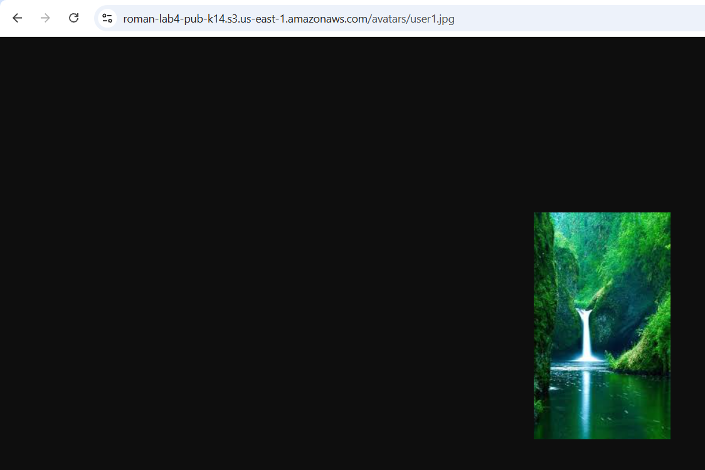 

2. Пробую открыть `URL` загруженного приватного объекта, и он недоступен. 
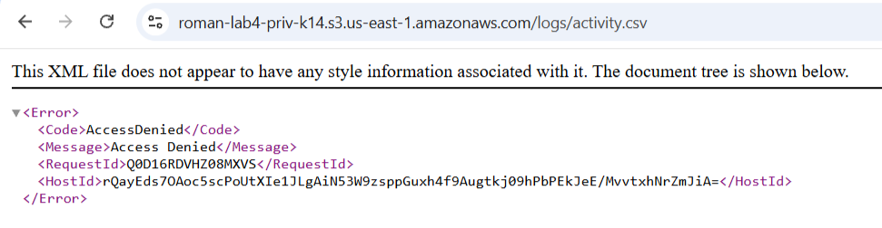 

## Шаг 6. Версионирование объектов
1. Включаю версионирование для обоих бакетов через вкладку `Properties` => `Bucket Versioning` => `Enable`. 
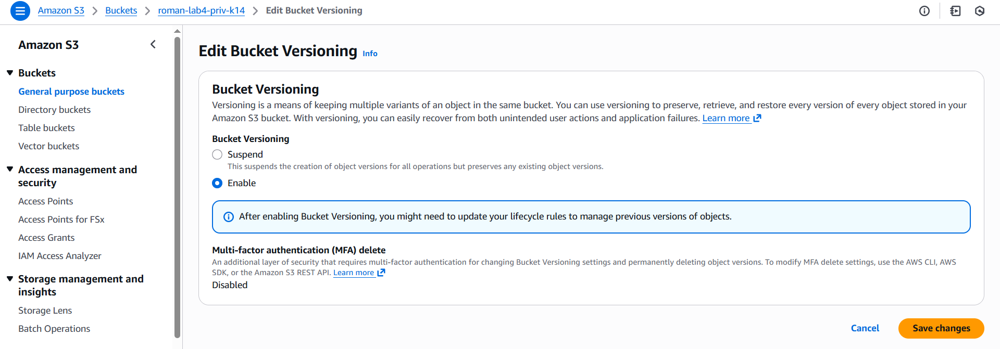 
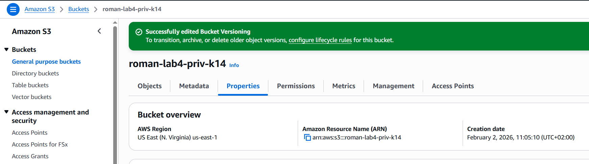 

2. Изменяю файл `logo.png` и загружаю его заново, чтобы увидеть создание новой версии. 
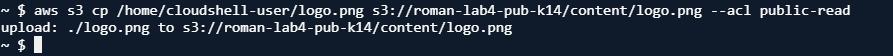 

3. В вкладке `Versions`, будут отображаться все версии объекта. 
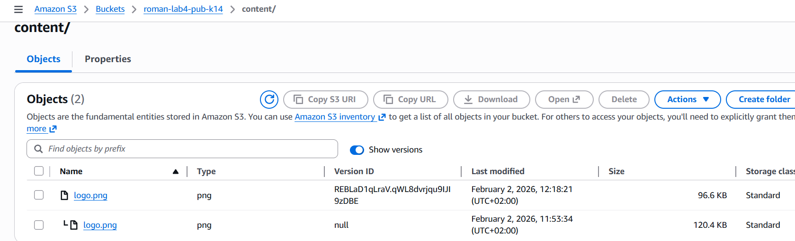 

**Контрольный вопрос**
Что произойдёт, если выключить версионирование после его включения? 
Старые версии не удаляются - все уже созданные версии объектов сохраняются 

Новые версии больше не создаются 
При перезаписи файла будет использоваться одна текущая версия 
Удаление файла создаёт delete marker, но старые версии всё равно остаются 

## Шаг 7. Создание Lifecycle-правил для приватного бакета
1. В приватном бакете захожу в `Management` => `Lifecycle rules` => `Create rule`. 
2. Указываю: 
- Имя: `logs-archive`
- Префикс: `logs/`
- Actions:
- - Transition => `Standard-IA` через 30 дней
- - Transition => `Glacier Deep Archive` через 365 дней
- - Expiration => `удалить через 1825 дней (5 лет)`  
3. Сохраняю правило: `Create rule`. 
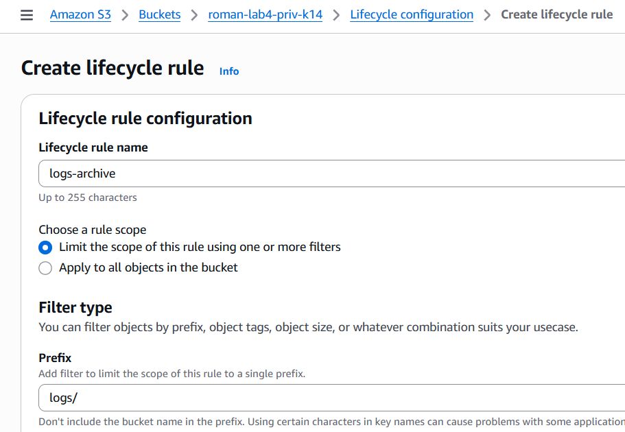 
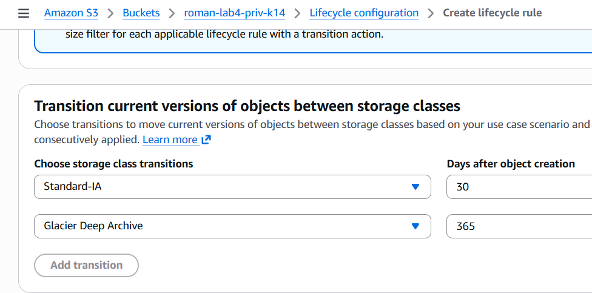 
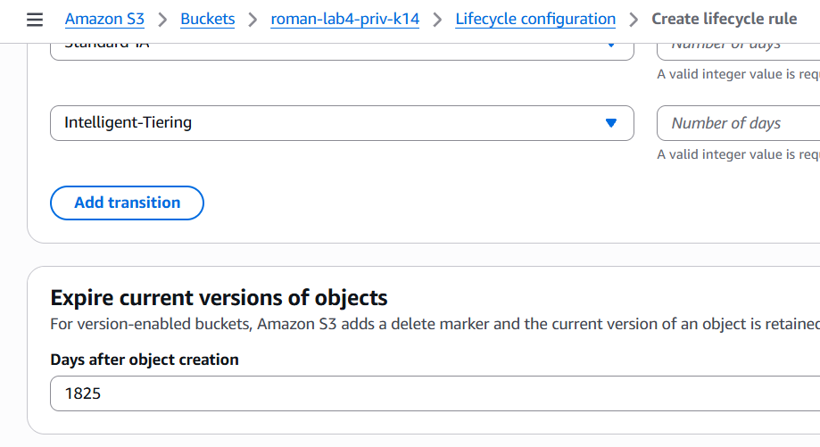 

**Контрольный вопрос**
Что такое Storage Class в Amazon S3 и зачем они нужны? 
В S3 Storage Class это класс хранения объекта, который определяет: 
- стоимость хранения
- доступность (насколько быстро можно получить файл)
- надёжность (как долго и безопасно хранится) 

Зачем нужны: 
- Чтобы экономить деньги
- Чтобы подбирать класс под нужды (частый доступ, архив, резерв)
- Чтобы оптимизировать скорость и стоимость 

## Шаг 8. Создание статического веб-сайта на базе S3
1. Создаю бакет `roman-lab4-web-k14` для хостинга статического сайта: 
- Имя: `roman-lab4-web-k14`
- Region: `eu-east-1`
- Object Ownership: `ACLs enabled`
- Block all public access: `снять галочку` 

2. Нажимаю `Create bucket`
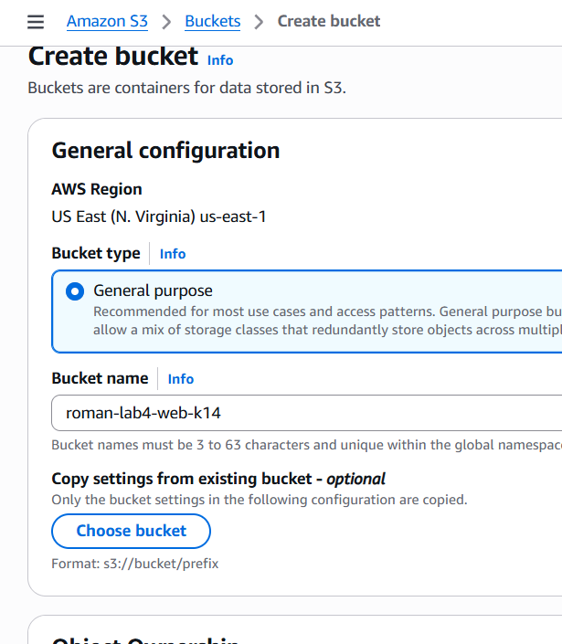 
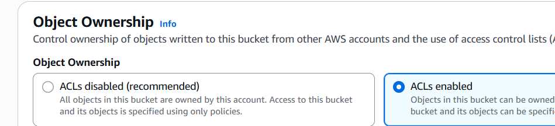 
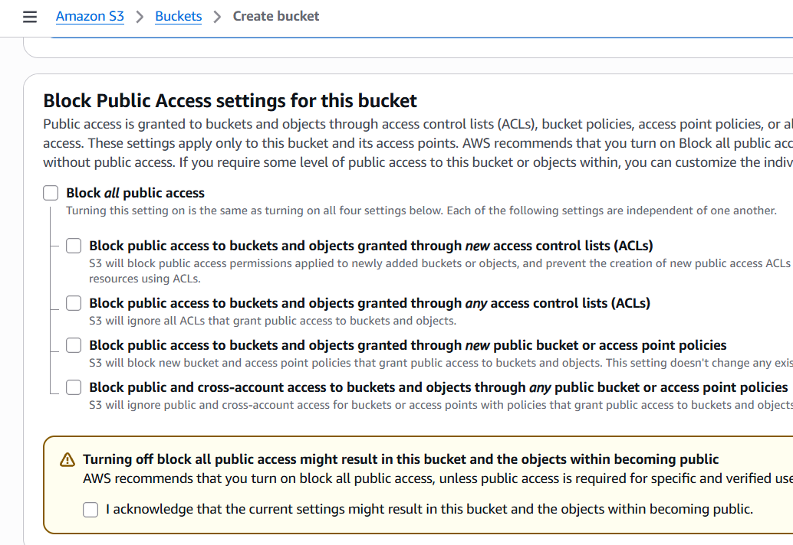 

3. Скопировал файлы веб-сайта в бакет `roman-lab4-web-k14`. 
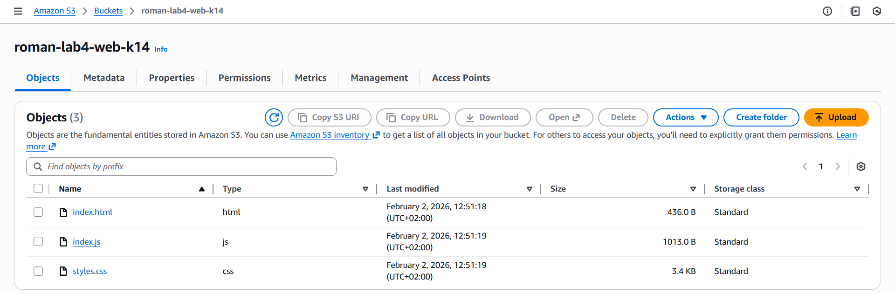 

4. Настраиваю хостинг: 
5. Перехожу в `бакет` => `Properties` => `Static website hosting` => `Edit` => `Enable`. 

6. Выбераю следующие параметры: 
- Hosting type: `Host a static website`.
- Index document: `index.html`. 
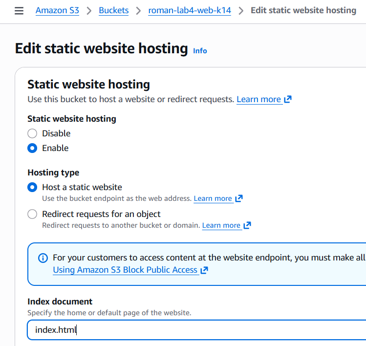 

7. Открываю URL статического сайта, указанный в настройках S3. 
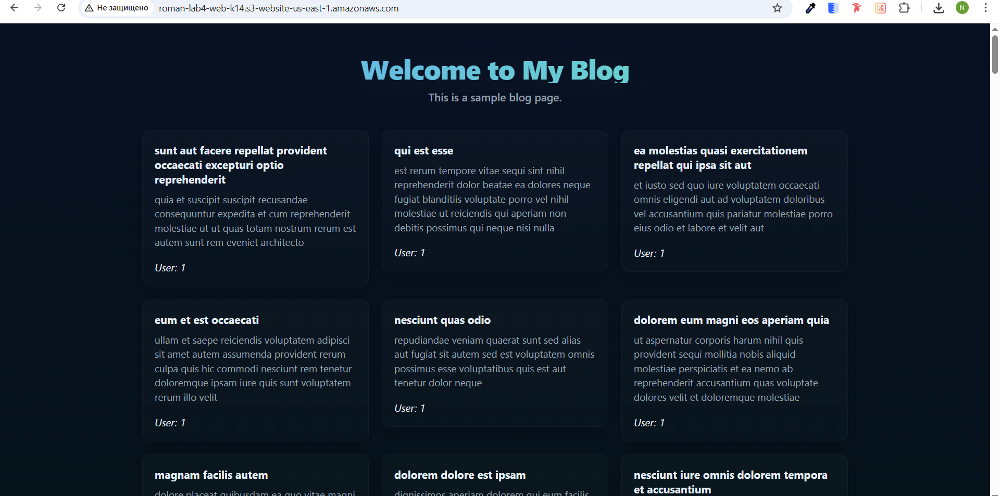 

## Источники
https://elearning.usm.md/ 
https://docs.aws.amazon.com/ 
Презентация. Введение в облачные вычисления 
Презентация. Архитектура облачных систем и основы виртуализации 
Презентация. Введение в Amazon Web Services (AWS). Глобальная архитектура AWS 
Презентация. Введение в вычислительные сервисы. Amazon AWS Elastic Compute Cloud 
Презентация. Виртуальные сети в облаке. Amazon VPC 
Презентация. Хранилища в облаке. Amazon S3, EBS, EFS 

## Вывод
Научился: 
- создавать публичные и приватные бакете; 
- загружать и организовывать объекты; 
- работать с S3 через AWS CLI (копирование, перемещение, синхронизация); 
- настраивать версионирование и шифрование; 
- использовать S3 Static Website Hosting; 
- применять Lifecycle-правила для архивирования старых данных. 
- создавать статический веб-сайт на базе S3 