# Лабораторная работа 6.
## IAFR2302 Gulica Roman  
**Тема:** Балансирование нагрузки в облаке и авто-масштабирование

## Цель работы
Закрепить навыки работы с AWS EC2, Elastic Load Balancer, Auto Scaling и CloudWatch, создав отказоустойчивую и автоматически масштабируемую архитектуру.

## Этапы работы
1. Создание VPC и подсетей
2. Создание и настройка виртуальной машины
3. Создание AMI
4. Создание Launch Template
5. Создание Target Group
6. Создание Application Load Balancer
7. Создание Auto Scaling Group
8. Тестирование Application Load Balancer
9. Тестирование Auto Scaling
10. Завершение работы и очистка ресурсов

## 1. Подготовка среды
1. Для выполнения лабораторных работ использовался **аккаунт** из **aws academy**. 
2. Как основная среда использовался аккаунт из **Lab6Scale & Load Balance your Architecture** 
 

3. Так как в sandbox ошибка при создании Auto Scaling Group на 2 этапе поэтому и использовался аккаунт из Lab 6. 
4. Также были выполнены все пункты из лабораторной работы в мудле но названия и некоторые моменты были использованны по требованию пунктов из aws academy Lab_6. 

## 2. Создание и настройка виртуальной машины
1. Запускаю виртуальную машину: 

2. Указываю: 
- AMI: `Amazon Linux 2`
- Тип: `t3.micro`
- Выбераю созданную `VPC` и `подсеть`.
- публичный `IP-адрес` `Enable auto-assign public IP`. 

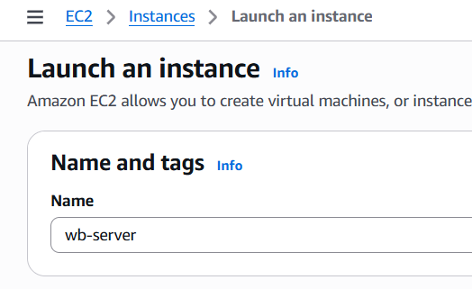 
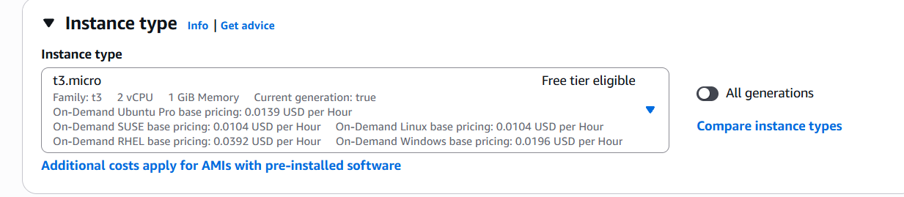 
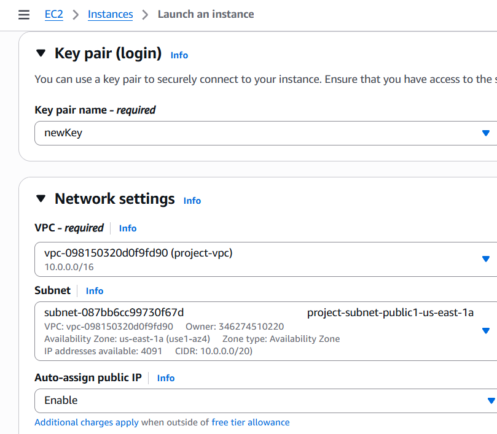 
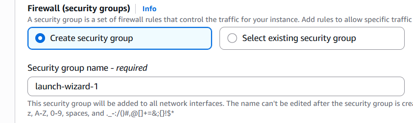 

3. В настройках безопасности создаю новую группу безопасности с правилами: 
Входящие правила: 
- SSH (порт 22) - источник: `мой IP`
- HTTP (порт 80) - источник: `0.0.0.0/0` 

Исходящие правила: 
- Все трафики - источник: `0.0.0.0/0` 

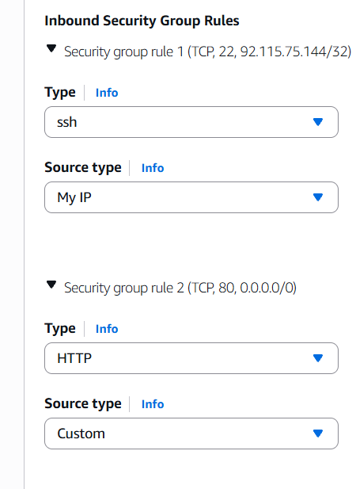 

4. В `Advanced Details` => `Detailed CloudWatch monitoring`: `Enable`. 
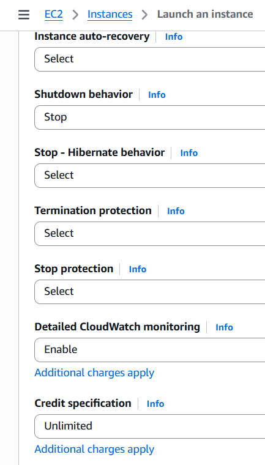 
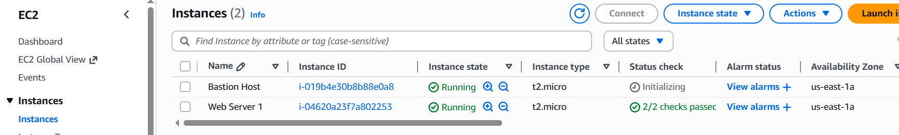 

## 3. Создание AMI
1. `EC2` => `Instance` => `Actions` => `Image and templates` => `Create image`. 
- name: `WebServerAmi`. 
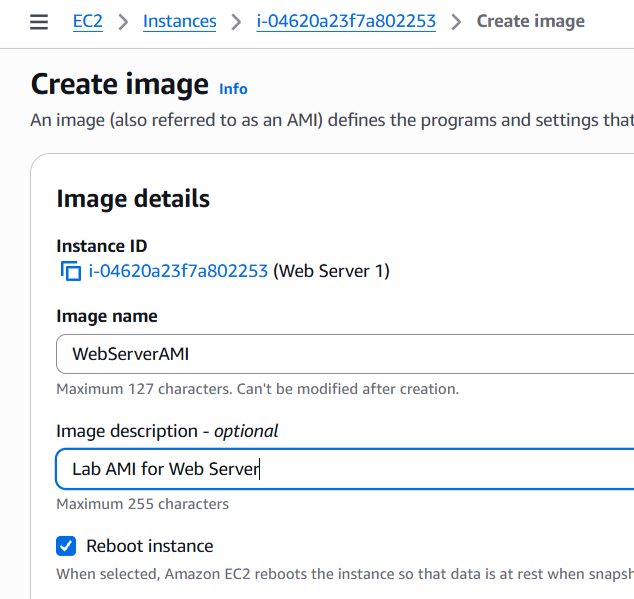 
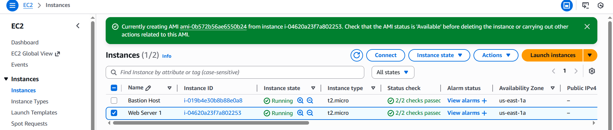 

**Контрольный вопрос**
Что такое image и чем он отличается от snapshot? Какие есть варианты использования AMI? 

AMI это шаблон виртуальной машины EC2, из которого запускаются новые инстансы. 
Snapshot это резервная копия одного диска (EBS volume). 

Варианты использования AMI 
- Миграция между регионами и аккаунтами
- Auto Scaling
- CI/CD и DevOps
- Резервное копирование серверов
- Быстрое создание одинаковых серверов 

## 4. Создание Launch Template

1. `EC2` => `Launch Templates` => `Create launch template`. 
2. Указываю параметры: 
- Launch template name: `Labconfig`
- Auto Scaling guidance: `галочка`
- Amazon Machine Image: `Web Server AMI`
- Instance type: `t2.micro`
- Key pair name: `vockey`
- Security groups: `Web Security Group`
- Detailed CloudWatch monitoring setting. `галочка` 
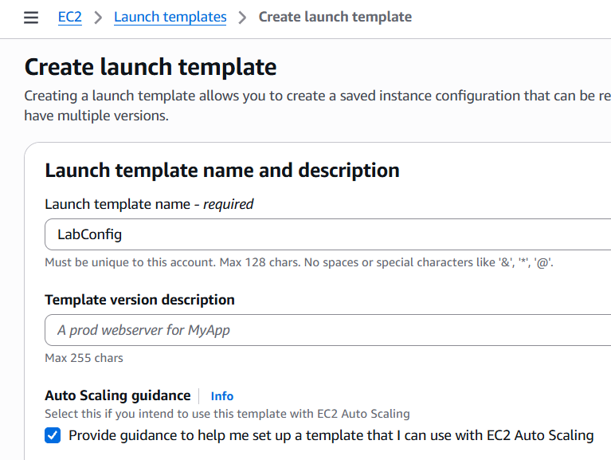 
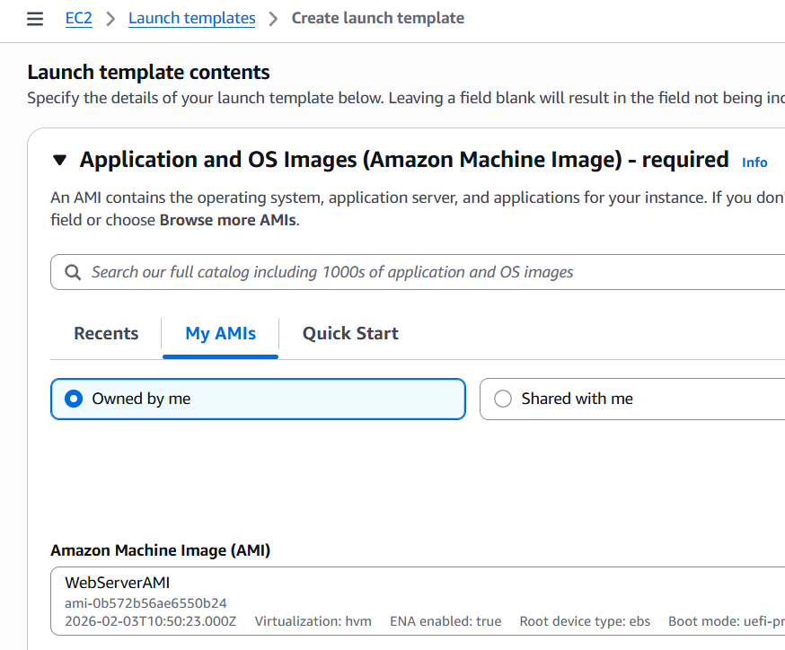 
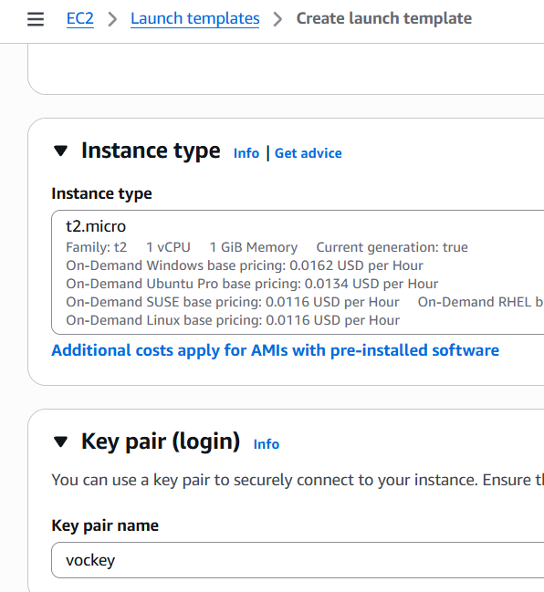 
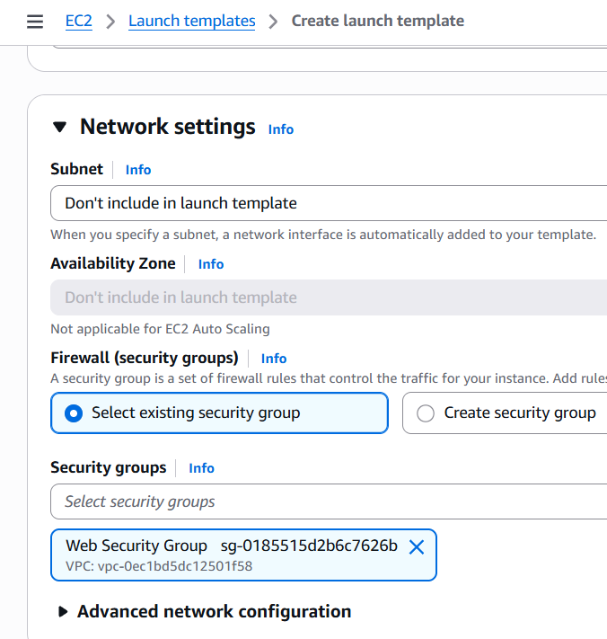 
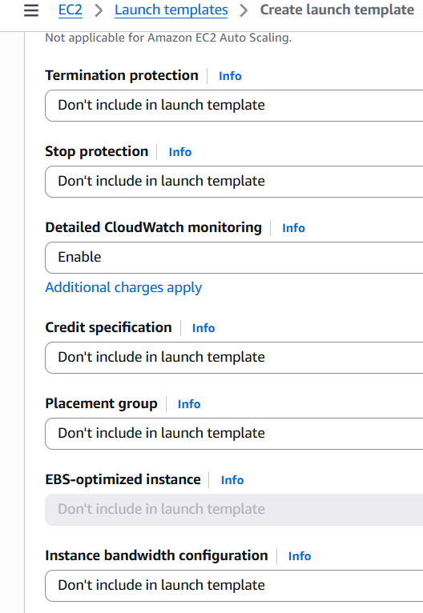 

**Контрольный вопрос**
Что такое Launch Template и зачем он нужен? Чем он отличается от Launch Configuration? 
Launch Template это шаблон, который описывает, как запускать EC2 (AMI, тип инстанса, сеть, security group, user-data и т.д.). 
Он нужен для автоматического и одинакового запуска серверов. 

Отличие от Launch Configuration: 
- Launch Template это современный и рекомендуемый
- Launch Configuration это устаревший, без версий и с ограничениями
- поддерживает версии
- поддерживает все новые возможности EC2 

## 5. Создание Target Group
1. `EC2` => `Target Groups` => `Create target group`. 

2. Указываю параметры: 
Название: `LabGroup`
Тип: `Instances`
Протокол: `HTTP`
Порт: `80`
VPC: `выбераю созданную VPC` 

3. Нажимаю `Next` => `Next` => `Create target group`. 
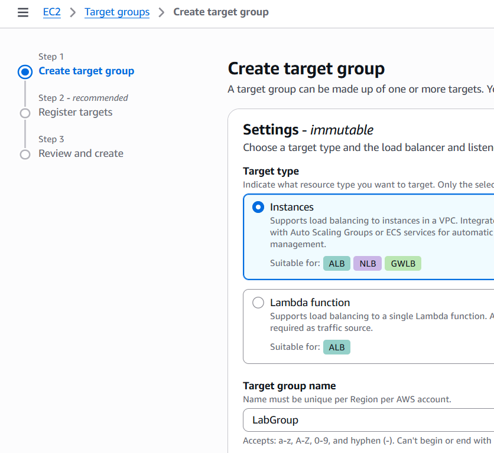 
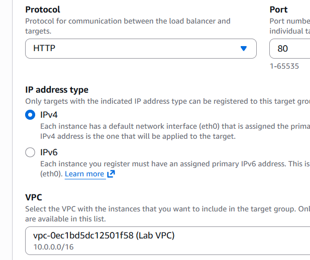 

**Контрольный вопрос**
Зачем необходим и какую роль выполняет Target Group? 
Target Group это группа ресурсов, на которые Load Balancer отправляет трафик. 

Зачем нужен Target Group 
- определяет куда именно передавать запросы
- выполняет health check (проверку работоспособности)
- автоматически исключает неработающие инстансы
- позволяет балансировать нагрузку 

Роль Target Group 
- Load Balancer принимает запрос
- Target Group решает, какие инстансы живы
- трафик идёт только на здоровые цели 

## 6. Создание Application Load Balancer
1. `EC2` => `Load Balancers` => `Create Load Balancer` => `Application Load Balancer`.

2. Указываю параметры: 
- Название: `LabELB`
- Scheme: `Internet-facing`.
- Subnets: `выбераю созданные 2 публичные подсети`.
- Security Groups: `Web Security Group`.
- Listener: `протокол HTTP, порт 80`.
- Default action: `Target Group project-target-group`. 

3. Нажимаю `Create load balancer`. 
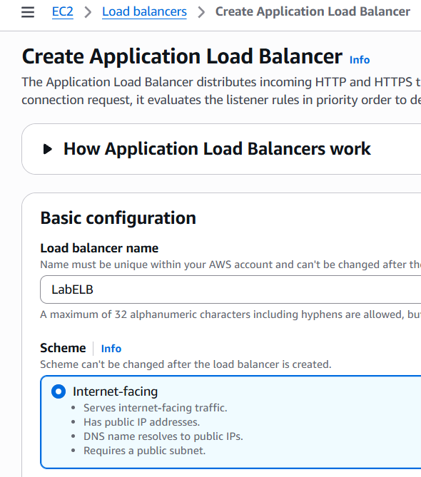 
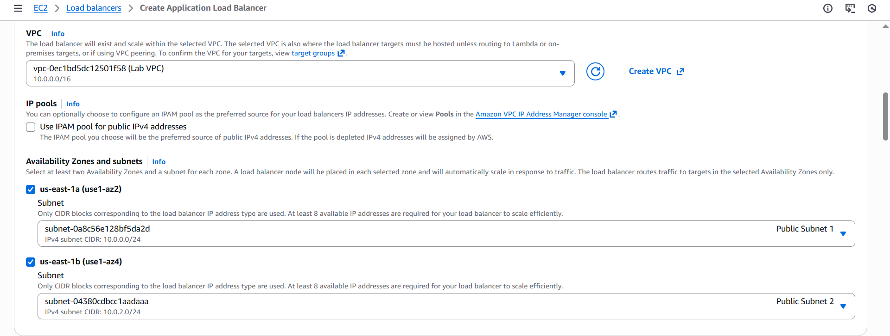 
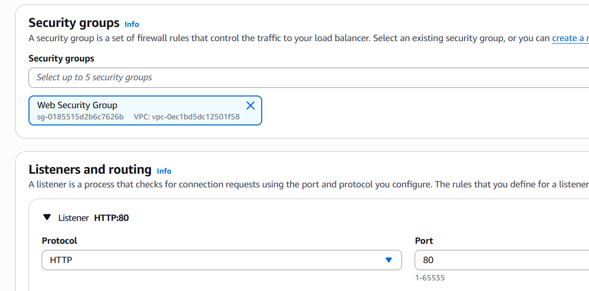 
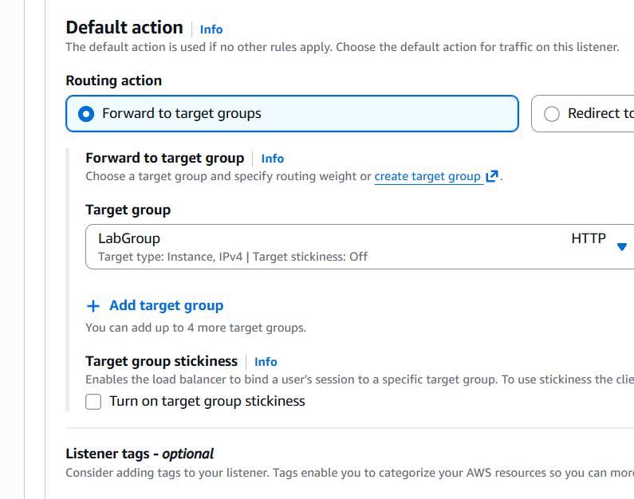 

**Контрольный вопрос**
В чем разница между Internet-facing и Internal? 
Internet-facing Load Balancer 
- Доступен из интернета
- Имеет публичный IP
- Используется для сайтов, API, публичных сервисов 

Internal Load Balancer 
- Доступен только внутри VPC
- Не имеет публичного IP
- Используется для внутренних сервисов (backend, базы, микросервисы) 

**Контрольный вопрос**
Что такое Default action и какие есть типы Default action? 

Что такое Default action 
Default action это действие, которое Load Balancer выполняет, если запрос не подошёл ни под одно правило. 

Типы Default action 
Forward - пересылает запрос в Target Group 
Redirect - перенаправляет пользователя на другой URL (например HTTP => HTTPS) 
Fixed response - возвращает готовый ответ (например ошибка 404 или сообщение) 

## 7. Создание Auto Scaling Group
`Actions menu` => `Create Auto Scaling group` 

1. (launch template or configuration):
- Auto Scaling group name: `Lab Auto Scaling Group`
- Launch template: `LabConfig`. 
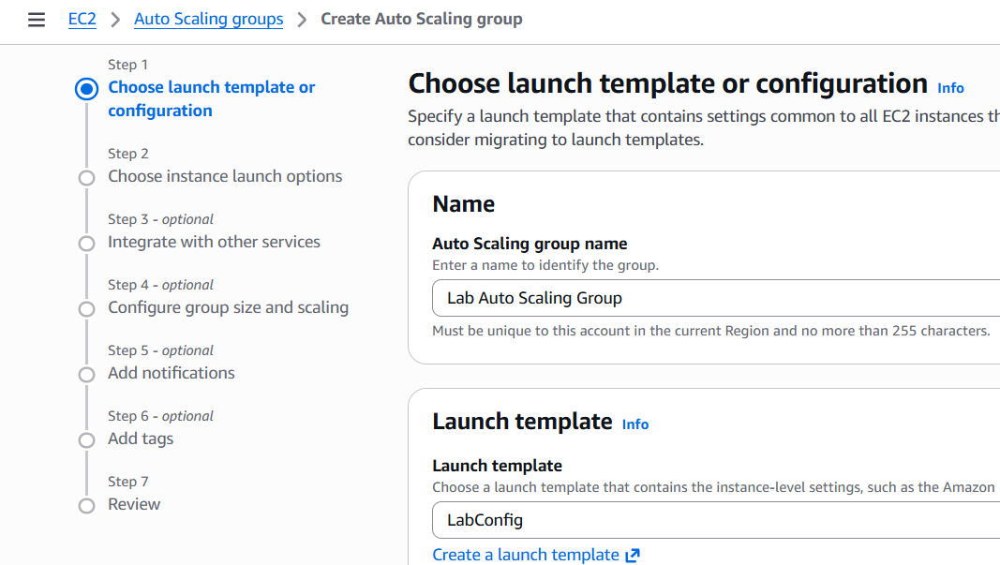 

2. (instance launch options):
- VPC: `Lab VPC`
- Availability Zones and subnets: `Private Subnet 1 and Private Subnet 2`. 
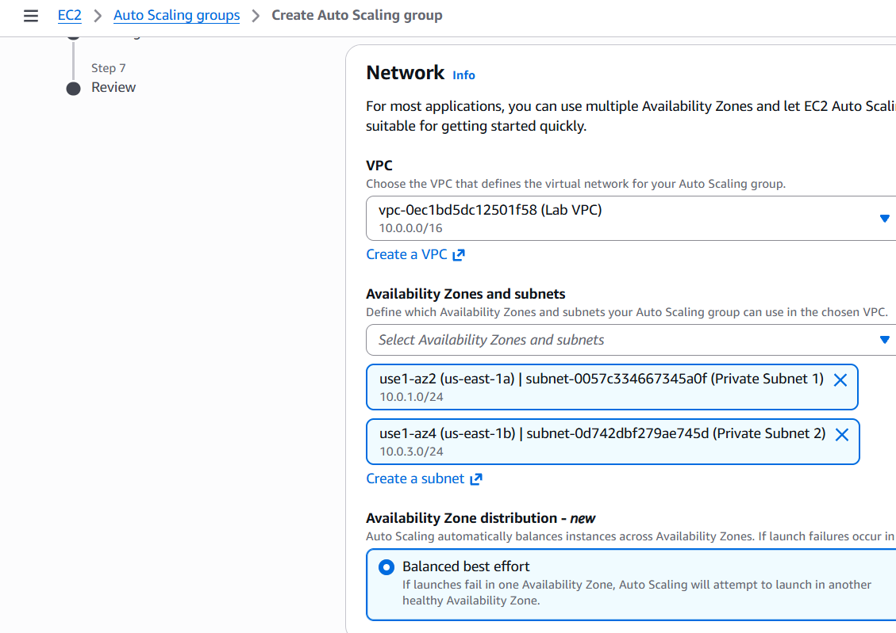 

3. (Configure advanced options):
- `Attach to an existing load balancer`
- Existing load balancer target groups: `LabGroup`.
- Additional settings pane: `Enable group metrics collection within CloudWatch` 
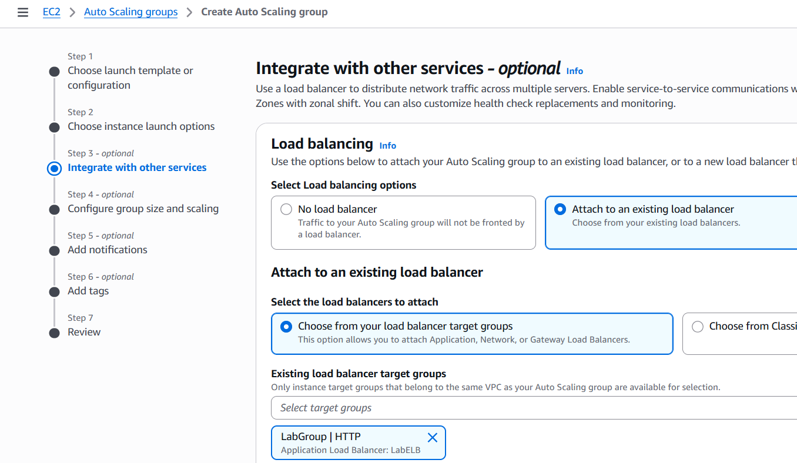 
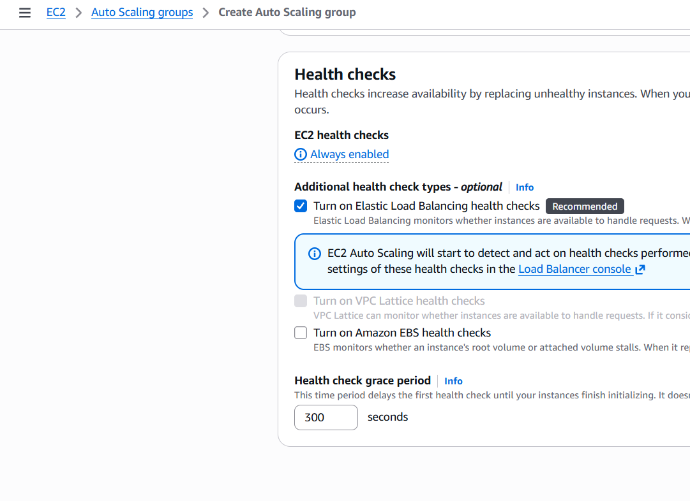 

4. (Configure group size and scaling policies - optional): 
- Desired capacity: `2`
- Minimum capacity: `2`
- Maximum capacity: `6` 
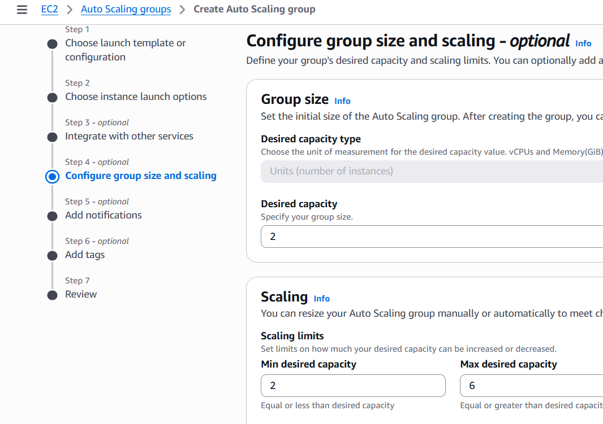 

Under Scaling policies: Target tracking scaling policy and configure:
- Scaling policy name: `LabScalingPolicy`
- Metric type: `Average CPU Utilization`
- Target value: `60` 
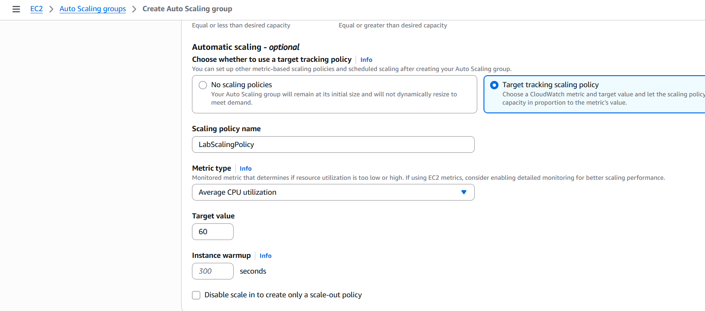 

5. (Add notifications - optional):
- `Next` 
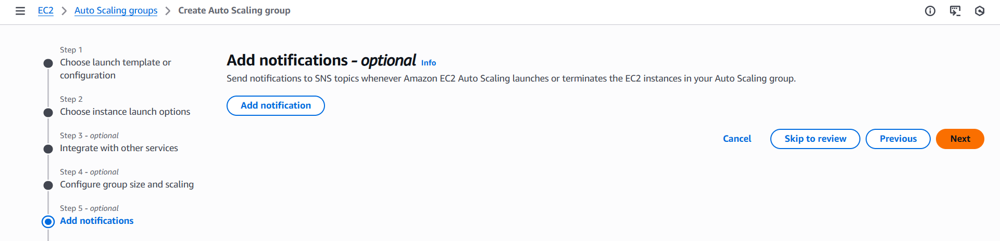 

6. (Add tags - optional):
`Add tag`:
- Key: `Name`
- Value: `Lab Instance` 
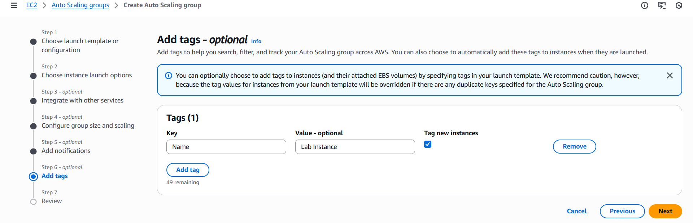 

6. (Review): 
Нажимаю `Create Auto Scaling group` 
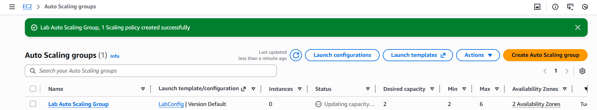 

**Контрольный вопрос**
Почему для Auto Scaling Group выбираются приватные подсети? 
- Инстансам не нужен прямой доступ из интернета
- Доступ к ним идёт через Load Balancer
- Это безопаснее (нет публичных IP)
- Соответствует best practice AWS 

**Контрольный вопрос**
Зачем нужна настройка: Availability Zone distribution? 
- Равномерно распределяет инстансы по разным AZ
- Повышает отказоустойчивость 

**Контрольный вопрос**
Что такое Instance warm-up period и зачем он нужен? 
Instance warm-up period это время, которое даётся новому EC2-инстансу, чтобы полностью запуститься и стать готовым к работе. 

Нужно, чтобы Auto Scaling не реагировал на сырые метрики и не масштабировал группу раньше времени. 

## 8. Тестирование Application Load Balancer
1. `EC2` => `Load Balancers`, выбераю созданный `Load Balancer` и копирую его `DNS-имя`. 
2. Вставляю `DNS-имя` в браузер и вижу страницу веб-сервера. 
3. Обновляю страницу несколько раз и смотрю на `IP-адреса` в ответах. 
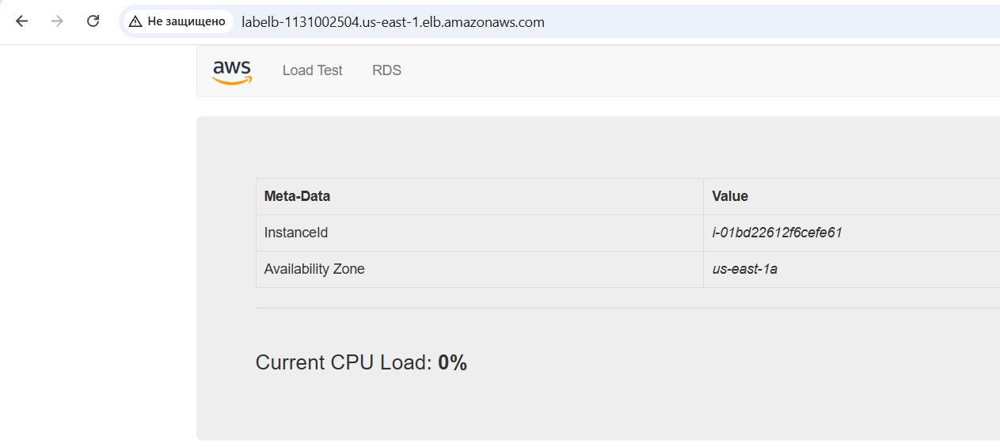 

**Контрольный вопрос**
Какие IP-адреса вы видите и почему? 
При обновлении страницы в ответах меняются IP-адреса. 

Обращаюсь не к EC2, а к Load Balancer который распределяет запросы между разными EC2-инстансами и каждый ответ приходит от другого инстанса, у которого свой private IP. 

## 9. Тестирование Auto Scaling
1. Сейчас запущено толко `2 инстанса` 
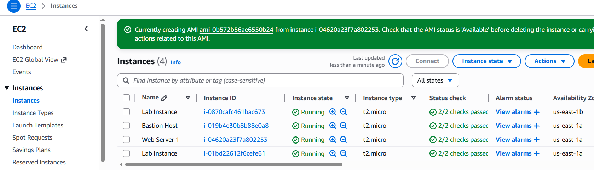 

2. Перехожу в `CloudWatch` => `Alarms` 
На экране появилось `2 alarms` 
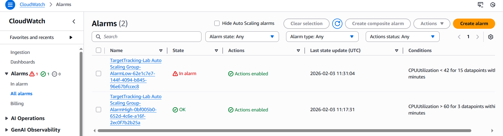 

3. Возвращаюсь на вкладку браузера с `веб-приложением`. 
4. Выбераю Load Test рядом с логотипом `AWS`. 
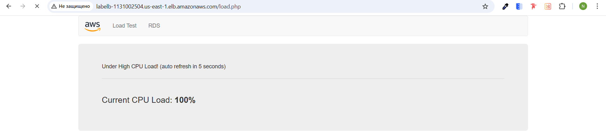 

5. Возвращаюсь на вкладку браузера с консолью `CloudWatch`. 
Через 5 минут статус тревоги `AlarmLow` измениться на `OK`, а статус тревоги `AlarmHigh` на `in allarm`. 
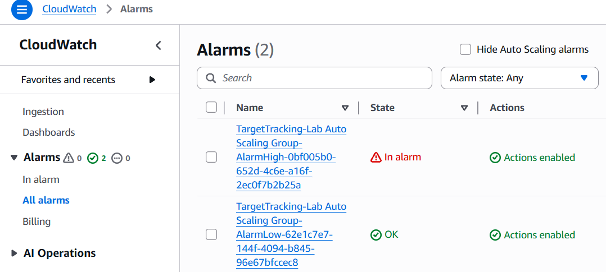 

На графике `AlarmHigh`, видно увеличение процента использования `ЦП`. 
Как только он пересечет линию 60% более чем на 3 минуты, запустится автоматическое масштабирование для добавления дополнительных экземпляров. 
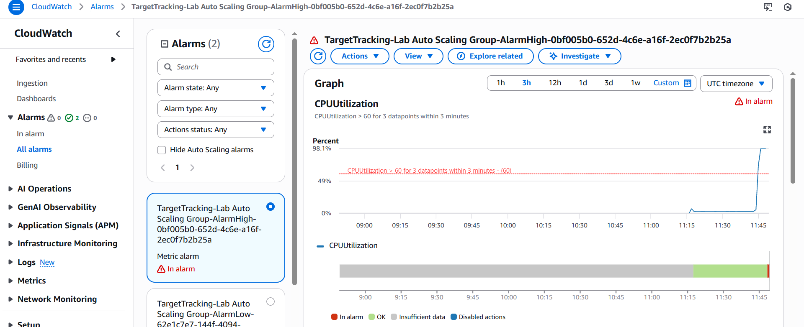 

`AlarmHigh` в состояние `in allarm`. 
6. Теперь могу увидеть дополнительные запущенные экземпляры. 
Новые экземпляры были созданы автоматическим масштабированием в ответ на тревогу `CloudWatch`. 
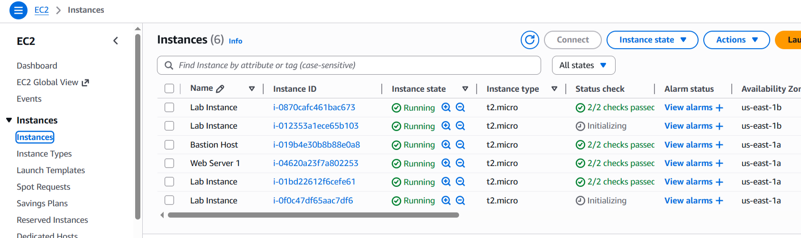 

**Контрольный вопрос**
Какую роль в этом процессе сыграл Auto Scaling? 
- Auto Scaling обеспечил наличие нескольких EC2-инстансов для обработки запросов.
- автоматически создал нужное количество инстансов
- поддерживает их число (добавляет/удаляет при необходимости)
- обеспечивает отказоустойчивость вместе с Load Balancer 

## 10 Удаление ресурсов
Все ресурсы удаляться автоматически так как это аккаунт действует только 2 часа.

## Источники
https://elearning.usm.md/ 
https://docs.aws.amazon.com/ 
Презентация. Введение в облачные вычисления 
Презентация. Архитектура облачных систем и основы виртуализации 
Презентация. Введение в Amazon Web Services (AWS). Глобальная архитектура AWS 
Презентация. Введение в вычислительные сервисы. Amazon AWS Elastic Compute Cloud 
Презентация. Виртуальные сети в облаке. Amazon VPC Fișier 
Презентация. Балансировка нагрузки и автоматическое масштабирование. AWS ELB, EC2 AutoScaling 

## Вывод
Научился: 
1. Создавать AMI
2. Создавать Launch Template
3. Создавать Target Group
4. Создавать Application Load Balancer
5. Создавать Auto Scaling Group
6. Тестировать Application Load Balancer
7. Тестировать Auto Scaling